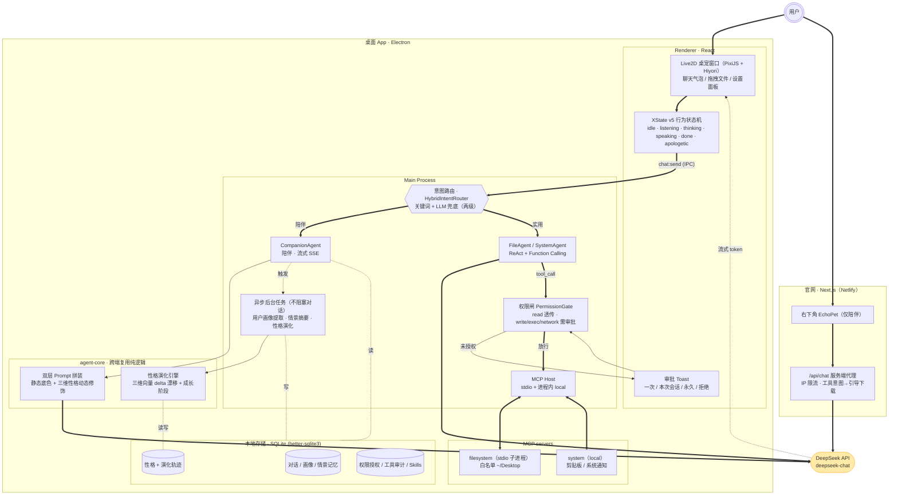

# EchoPet — 住在桌面的小伙伴

> 一只有记忆、有人格、还能帮你动手的 Live2D 桌面宠物。会陪你聊天、记得你说过的话，性格随相处慢慢长成「你的」样子；也能读写文件、识图、设提醒——**动手前都会先问你一句**。

<p align="center">
  🌐 <strong>官网 / 在线试玩：<a href="https://echopet.netlify.app/">echopet.netlify.app</a></strong>
  &nbsp;·&nbsp;
  ⬇️ <strong>下载桌面版：<a href="https://github.com/19972127982-png/momo/releases/latest">GitHub Releases</a></strong>（macOS · Apple Silicon）
</p>

> 聊天走 DeepSeek API，其余全部本地运行；对话、记忆、密钥都只留在你自己的电脑上，不上云。

---

## 产品介绍

EchoPet 是一只常驻在桌面角落的 Live2D 小伙伴。它想做的不是又一个「问答助手」，而是一个**越处越懂你、会陪也会帮忙**的存在：

- **会陪你聊天** — 先听你说、再轻轻接住情绪，而不是冷冰冰一问一答。
- **越处越懂你** — 记得你提过的事，性格也会随相处慢慢漂移，日积月累养出一只只属于你的 EchoPet。
- **帮你动手** — 整理桌面文件、读写文件、识别图片文字、设个到点通知的提醒；每一次「动手」前都先弹窗征得你同意。
- **隐私优先** — 聊天记录、记忆、API Key 全部本地存储，桌面端代码里没有任何上传通道。

官网右下角内置了一个**网页版 EchoPet**，用的是同一套「大脑」逻辑，但只保留「陪伴」能力——想让它动手的需求会被识别并引导你下载桌面版。

---

## 她能陪你做点什么

| | 能力 | 说明 |
|---|------|------|
| 💬 | **情感陪伴 + 记忆** | 先共情再回应；累计对话自动提炼「情景记忆」和「用户画像」，聊得越久越懂你 |
| 🌱 | **性格自适应** | 用三维向量（活力 / 依恋 / 敏感度）描述性格，每轮对话后极微幅漂移，长期养成独一无二的性格 |
| 📄 | **读写文件** | 自然语言让它看看桌面有什么、读某个文件、新建 / 写入 / 归整文件（写操作走审批） |
| 🖼️ | **图片识别** | 拖一张图给它，本地 OCR 识别文字后接着处理 |
| ⏰ | **创建提醒** | 说一句「提醒我…」，到点用系统通知叫你 |
| 🔒 | **权限与技能** | 起名字 / 设称呼、启停技能包、逐项管理工具授权，全在设置面板 |

---

## 技术架构

界面只管表现，「大脑」沉淀成可跨端复用的**纯逻辑包**（`agent-core`），动手能力收在**主进程**、由**权限闸**把关，数据全部落在**本地 SQLite**。下图是当前代码的真实结构：



**几条关键设计：**

- **一次对话 = 一条同步主链路 + 若干异步后台任务。** 用户看到的回应（意图路由 → Agent → DeepSeek 流式）在感知延迟内完成；画像提取、情景摘要、性格漂移都在回应之后异步跑，任一失败都 swallow，不影响对话。
- **性格是「双层」的。** 第一层是写死的人格底色（温暖、短句、先共情），第二层由性格演化引擎的三维向量动态修饰。纯漂移会「长歪」，双层保住基线、只让风格细节变化。
- **动手能力必过权限闸。** `read` 类工具透传，`write / exec / network` 未授权则阻塞并弹审批 toast（一次 / 本次会话 / 永久 / 拒绝）；每次工具调用无论成败都写审计日志。
- **桌面 ↔ 官网零数据流通。** 桌面端不含任何云端 endpoint；官网只是同一套 `agent-core` 的「仅陪伴」子集 + 服务端代理，不落地任何用户数据。

### 性格三维

| 维度 | 一端 | 另一端 | 初始锚点 | 区间 |
|------|------|--------|----------|------|
| energy | 安静内敛 | 活泼好动 | 0.0 | [-1, +1] |
| attachment | 独立 | 粘人 | +0.2 | [-0.5, +1.0] |
| sensitivity | 钝感踏实 | 细腻共情 | -0.3 | [-0.6, +0.8] |

随互动次数推进成长阶段：**初识（<30）→ 熟悉（<100）→ 亲密（<250）→ 挚友（≥250）**。

---

## 技术栈

全 TypeScript · pnpm monorepo。

| 层 | 用了什么 |
|----|----------|
| **桌面端** | Electron · electron-vite · React 19 · PixiJS 6.5 + pixi-live2d-display（Cubism 4 / Hiyori PRO）· XState v5 |
| **AI 对话** | DeepSeek（OpenAI 兼容）· 陪伴流式 SSE · 工作族 Function Calling · 双层 Prompt |
| **Agent / 工具** | MCP（Model Context Protocol）host（stdio + local）· 权限闸 · Skills 技能包 · 性格演化引擎 |
| **记忆 / 数据** | SQLite（better-sqlite3）· 全本地 · tesseract.js 本地 OCR |
| **官网** | Next.js 16 · Tailwind CSS 4 · Netlify |
| **工程** | pnpm workspace · Vitest · 跨端复用 `agent-core` |

### 仓库结构

```
桌宠/
├── apps/
│   ├── desktop/          Electron 桌宠主程序（主进程 Agent 编排 / MCP / 权限闸 / SQLite）
│   └── web/              官网（Next.js）：落地页 + Live2D widget + /api/chat 陪聊代理
├── packages/
│   ├── agent-core/       意图路由 · Agent · 记忆接口 · 双层 Prompt · 性格演化（纯逻辑，跨端复用）
│   ├── mcp-host/         MCP host：stdio spawn + MCP↔DeepSeek Function Calling bridge
│   └── state-machine/    XState v5 行为状态机（→ Live2D motion 指令）
├── scripts/              setup-cubism-core.sh 等资产准备脚本
└── docs/                 产品与设计文档
```

---

## 本地运行

### 前置

| 工具 | 版本 |
|------|------|
| Node | ≥ 20 |
| pnpm | ≥ 9 |

```bash
pnpm install
pnpm setup:cubism   # 拉 Cubism Core + 拷贝 Hiyori 模型（均已 gitignore）
pnpm dev            # 起 dev server + Electron
```

> ⚠️ **必须在原生 Terminal.app / iTerm 里跑，不要在编辑器内置终端里跑**（原因见下方「注意事项」）。

启动后屏幕右下角会出现一个透明置顶窗口。首次启动会弹设置面板，前往 [platform.deepseek.com](https://platform.deepseek.com) 申请一个 `sk-...` key 填入即可开始聊天。

- API Key 以 base64 轻混淆 + `0600` 权限存在 `userData/apikey.dat`（仅本机当前用户可读，不上传）。
- 名字 / 称呼存在 `settings.json`（明文，原子写）。

### 常用命令

```bash
pnpm dev                                    # dev
pnpm -r typecheck                           # 全 workspace 类型检查
pnpm --filter @echopet/state-machine test   # 状态机单测
pnpm --filter @echopet/desktop build:mac    # 打 macOS .dmg
```

打包做了「拿到就能用」：MCP filesystem server 已作为依赖打进包、用 Electron 自带 Node 拉起（用户无需装 Node/npx）；Cubism Core + Hiyori 模型随产物自带。当前为**未签名 / 未公证**构建，macOS 首次打开需在「系统设置 → 隐私与安全性」点「仍要打开」，或执行 `xattr -dr com.apple.quarantine /Applications/EchoPet.app`。

---

## 注意事项（开发环境）

1. **编辑器内置终端启动 Electron 会 SIGABRT。** macOS 把 Electron 当作编辑器子进程、沿用其 LaunchServices coalition，注册 Window Server 时冲突被 kill。→ 用原生 Terminal.app / iTerm 跑 `pnpm dev`。
2. **`ELECTRON_RUN_AS_NODE=1` 泄漏。** 某些编辑器给内部 Node 设了该变量并泄漏到子 shell，会强制 Electron 以纯 Node 模式跑。→ `dev` / `start` 脚本已前置 `env -u ELECTRON_RUN_AS_NODE`。
3. **pnpm 11+ 默认拦截 build script。** → `pnpm-workspace.yaml` 已用 `onlyBuiltDependencies` 放行 electron / esbuild 等。
4. **PixiJS 锁在 v6。** `pixi-live2d-display@0.4` 死锁 `pixi.js@^6` peer，暂不能升 v7。

---

## 协议 & 致谢

- **Live2D Hiyori PRO** — [Live2D Free Material License](https://www.live2d.com/eula/live2d-free-material-license-agreement_en.html)：允许个人及小企业商用，作品集用途无限制；设计不可二次改动，使用须标注 "Live2D Cubism" 来源。
- **Cubism Core for Web** — Live2D Proprietary Software License，运行时可分发，不进 git。
- **EchoPet 自身代码** — MIT。
