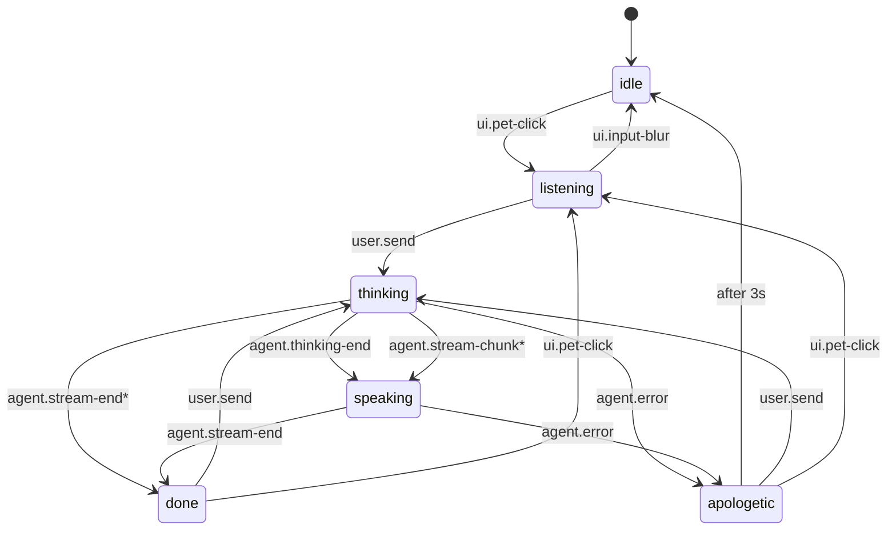

# EchoPet — 情感陪伴桌面宠物

> 基于 EchoMind 多 Agent 框架的 Live2D 桌面宠物。技术栈：**Electron + React + PixiJS v6 + pixi-live2d-display + XState v5 + DeepSeek**。
>
> 当前里程碑：**W4 ✅ — 实用 Agent 族 + 权限闸 + 审批 UX + Skills**（意图路由 → FileAgent/SystemAgent 调工具 → write/exec 弹审批 toast → 永久授权/撤销/审计）

详细产品规划见 [docs/PRD.md](docs/PRD.md)，架构总览见 [docs/ARCHITECTURE.md](docs/ARCHITECTURE.md)；技术方案：
[W1 — Hiyori demo](docs/W1-TECH-PLAN.md) · [W2 — LLM + 状态机](docs/W2-TECH-PLAN.md) · [W3 — 意图路由 + 多 Agent + 记忆](docs/W3-TECH-PLAN.md) · [W4 — 权限闸 + 审批 + Skills](docs/W4-TECH-PLAN.md) · [状态机设计](docs/STATE-MACHINE.md)

---

## 状态机一览



\* 兜底转移 —— renderer 漏发事件 / 零 token 回复都不会卡死。完整设计见 [docs/STATE-MACHINE.md](docs/STATE-MACHINE.md)。

---

## 仓库结构

```
桌宠/
├── apps/
│   ├── web/                           作品集网站（Next.js 16 + TS + Tailwind v4，部署 Vercel）
│   │   ├── src/app/                   页面 + /api/chat 陪聊代理（持密钥 / IP 限流 / 仅陪伴）
│   │   ├── src/components/            PetWidget（右下角小桃）+ Live2DStage（Web 端 Hiyori）
│   │   ├── src/lib/                   useChat（工具意图短路引导下载）+ 限流 + 陪伴 prompt
│   │   └── public/cubism · live2d/    Live2D 资产（随仓库提交，供 Vercel 构建）
│   └── desktop/                       Electron 桌宠主程序（electron-vite + React + TS）
│       ├── src/
│       │   ├── main/
│       │   │   ├── index.ts           IPC 注册 + 拖动 + 单例锁 + API Key 启动加载
│       │   │   ├── window.ts          460×760 透明置顶窗口
│       │   │   ├── llm.ts             DeepSeek SSE 流式 + AbortController + 60s 超时
│       │   │   ├── configStore.ts     API Key 本地文件存储 + settings.json 原子写
│       │   │   └── personality.ts     性格三维 snapshot（W2 mock，W3 接演化引擎）
│       │   ├── shared/
│       │   │   └── ipcTypes.ts        main / preload / renderer 共享类型
│       │   ├── preload/
│       │   │   ├── index.ts           暴露 echopet.{pet,chat,config,personality}
│       │   │   └── index.d.ts
│       │   └── renderer/
│       │       └── src/
│       │           ├── live2d/        bootstrap + modelLoader
│       │           ├── components/    PetCanvas / ChatBubble / ChatInput / ConfigDialog
│       │           ├── App.tsx        useMachine + 接全部 IPC + click vs drag
│       │           └── main.tsx
│       ├── build/                     打包资源：icon.icns / icon.ico / icon.png（白底粉色线条桃子）
│       ├── electron-builder.yml       打包配置（appId=com.echopet.desktop / productName=EchoPet）
│       └── public/
│           ├── cubism/                Cubism Core (gitignored, setup 脚本下载)
│           └── live2d/hiyori/         Hiyori PRO 模型 (gitignored, setup 脚本拷贝)
├── packages/
│   ├── agent-core/                    意图路由 + Agent 族 + Skills（@echopet/agent-core）
│   ├── mcp-host/                      MCP host：stdio / 进程内 local server（@echopet/mcp-host）
│   └── state-machine/                 XState v5 状态机包（@echopet/state-machine）
│       ├── src/                       machine.ts / types.ts / index.ts
│       └── test/                      vitest 23 用例
├── docs/                              PRD / 架构 / W1~W4 / 状态机设计
├── scripts/
│   └── setup-cubism-core.sh           一键拉取 Cubism Core + 拷贝 Hiyori
├── pnpm-workspace.yaml
└── package.json                       workspace root
```

---

## 快速启动

### 0. 前置工具

| 工具 | 版本要求 | 当前我这台 |
| --- | --- | --- |
| Node | ≥ 20 | v24.14 |
| pnpm | ≥ 9 | 11.5.2 |
| git | 任意 | 2.50 |

```bash
# 如果还没装 pnpm
brew install pnpm   # macOS
```

### 1. 装依赖

```bash
git clone <repo> 桌宠
cd 桌宠
pnpm install
```

> pnpm 11+ 第一次 install 会要求显式批准 `electron / esbuild / electron-winstaller` 三个有 build script 的依赖。
> 仓库里 `pnpm-workspace.yaml` 的 `allowBuilds:` 已经把它们都设成 `true`，所以应该一路绿。

### 2. 拉 Live2D 资源

```bash
pnpm setup:cubism
```

这个脚本会：

1. 从 Live2D 官方 CDN `cubism.live2d.com/sdk-web/cubismcore/live2dcubismcore.min.js` 下载 Cubism Core 到 `apps/desktop/public/cubism/`。
2. 把 `hiyori_en/hiyori_pro/runtime/` 拷贝到 `apps/desktop/public/live2d/hiyori`（拷成实体文件，保证打包产物自带模型）。

两项资源都已经在 `.gitignore` 里，不会进 git。

> 打包时无需手动执行：`pnpm build` / `build:mac` / `build:linux` 已在前面自动跑一遍资产准备（`setup:assets` → `setup-cubism-core.sh`），产物自带 Cubism Core + Hiyori 模型。

### 3. 启动 dev

```bash
pnpm dev
```

> ⚠️ **必须在原生 Terminal.app / iTerm 里跑，不要在 Cursor 内置终端里跑。**
> 详见下文「已知坑」。

成功的话，屏幕右下角会出现一个 460×760 的透明窗口：上方气泡 / 中间 Hiyori / 下方输入框（默认隐藏）。

### 4. 首次启动 — 配置 DeepSeek API Key

启动后会自动弹出设置面板，前往 [platform.deepseek.com](https://platform.deepseek.com) 申请一个 `sk-...` key，填入保存即可。

- API Key 以 base64 轻混淆 + `0600` 权限存在 `userData/apikey.dat`（仅本机当前用户可读，不上传）。早期版本用 `safeStorage`/Keychain，但未签名分发会导致每次启动弹钥匙串密码，故改为本地文件
- 桌宠名字 / 称呼存在 `~/Library/Application Support/echopet-desktop/settings.json`（明文，原子写）
- 性格三维进度条目前是 W2 mock，W3 会接真实演化数据

---

## 已知坑 ( W1 自测时全踩过一遍 )

### 1. Cursor 终端启动 Electron 会 SIGABRT

**症状**：从 Cursor 内置终端跑 `pnpm dev`，electron-vite 显示 "starting electron app..." 后立刻退出，没有窗口出现。
查 `~/Library/Logs/DiagnosticReports/Electron-*.ips` 能看到崩在 `_RegisterApplication` → `+[NSApplication sharedApplication]` → `abort`。

**原因**：macOS 把 Electron 当作 Cursor 子进程，沿用 Cursor 的 LaunchServices coalition；当 Electron 子进程试图自己注册到 Window Server 时，因为 coalition 冲突直接被系统 kill。`responsibleProc: Cursor` 是关键线索。

**修复**：开一个原生的 Terminal.app / iTerm / Warp 窗口，从那里 `cd 桌宠 && pnpm dev`。

### 2. `ELECTRON_RUN_AS_NODE=1` 环境变量泄漏

**症状**：`require('electron')` 返回字符串路径而不是 API 对象；`process.type === undefined`。

**原因**：Cursor 本身是 Electron 应用，为自己的内部 Node 进程设了 `ELECTRON_RUN_AS_NODE=1`，并且这个变量泄漏到了它启动的所有子 shell 里。当我们再起 Electron 时，这个变量会强迫 Electron 以纯 Node 模式运行，不加载 Electron 内置模块。

**修复**：`apps/desktop/package.json` 的 `dev` / `start` 脚本已经前置 `env -u ELECTRON_RUN_AS_NODE`，所以即使父 shell 有这个变量也会被剥离。

### 3. pnpm 11+ 默认拦截 build script

**症状**：`pnpm install` 完输出 `[ERR_PNPM_IGNORED_BUILDS] Ignored build scripts: electron / esbuild / electron-winstaller`，然后 Electron 二进制根本没下载，`electron-vite dev` 起不来。

**修复**：仓库根的 `pnpm-workspace.yaml` 里加：

```yaml
allowBuilds:
  electron: true
  electron-winstaller: true
  esbuild: true
onlyBuiltDependencies:
  - electron
  - electron-winstaller
  - esbuild
```

以及 `.npmrc` 关掉 `strict-dep-builds` + `confirm-modules-purge`。

### 4. PixiJS 版本不能漂到 v7+

`pixi-live2d-display@0.4` 死锁定 `pixi.js@^6` peer。我们在 `apps/desktop/package.json` 把 `pixi.js` 锁到 `~6.5.10`，未来升级要等 `pixi-live2d-display` 出 v7 兼容版本（社区 fork 已有，但稳定性 W1 不押）。

---

## 常用命令

```bash
pnpm dev                                       # 起 dev server + Electron
pnpm build                                     # setup:assets + typecheck + 构建到 out/
pnpm -r typecheck                              # 全 workspace 静态类型检查
pnpm --filter @echopet/state-machine test      # 状态机 23 单测
pnpm setup:cubism                              # 重新拉 Cubism Core + 拷贝 Hiyori
```

---

## 构建 & 分发

```bash
pnpm --filter @echopet/desktop build:mac       # macOS .dmg
pnpm --filter @echopet/desktop build:win       # Windows 安装包
pnpm --filter @echopet/desktop build:linux     # AppImage / snap / deb
```

打包面向「拿到就能用」做了几件事，普通用户无需任何开发环境：

- **免 npx / 免装 Node**：文件管家用的 `@modelcontextprotocol/server-filesystem` 已作为依赖打进包，运行时用 Electron 自带的 Node（`ELECTRON_RUN_AS_NODE`）直接拉起，用户机器无需预装 Node/npx，也不联网下包。
- **自带 Live2D 资产**：`build:*` 会先跑 `setup:assets`，把 Cubism Core + Hiyori 模型准备好再打包，产物自带模型。
- **品牌信息**：`appId=com.echopet.desktop`、`productName=EchoPet`、图标走 `build/icon.{icns,ico,png}`（白底 + 粉色线条桃子）。

> 当前为**未签名 / 未公证**构建。macOS 首次打开会被 Gatekeeper 拦，需在「系统设置 → 隐私与安全性」点击「仍要打开」，或对下载的 app 执行 `xattr -dr com.apple.quarantine /Applications/EchoPet.app`。
>
> 仍需联网的只有 **DeepSeek API**（聊天）：首次启动在设置面板填入 `sk-...` key 即可。

---

## 验收检查点

### W1 ✅（已交付，commit `88fc635`）

1. ✅ 右下角出现透明窗口（无窗框、无标题栏）
2. ✅ 窗口透明背景不挡其他应用
3. ✅ Hiyori 完整渲染（头、身体、双手都在画布内）
4. ✅ Cmd+Shift+Q 全局退出生效

### W2 ✅（已交付，commit `c110e52`）

1. ✅ 首次启动跳出设置面板，输入 key 后保存且窗口能正常用
2. ✅ 二次启动直接进入主界面
3. ✅ 点击角色（< 5px 位移）→ 输入框淡入 + 角色 FlickUp
4. ✅ 拖动角色（> 5px 位移）→ 窗口跟手，不触发输入框
5. ✅ Enter 发送 → 角色切 thinking → DeepSeek 流式 → 气泡逐字 + Tap 张嘴
6. ✅ 完成 5s 后气泡自动淡出
7. ✅ API Key / 网络错误 → apologetic + FlickDown + 错误气泡（3s 自动恢复，或用户点击立刻退出）
8. ✅ 设置面板能改名字 / 称呼，性格三维进度条展示（mock）
9. ✅ 状态机 23/23 单测全过（含兜底场景）

W3 起接入：意图识别 + 多 Agent + 三层记忆 + 性格自适应漂移。

---

## 协议 & 致谢

- **Live2D Hiyori PRO**：[Live2D Free Material License](https://www.live2d.com/eula/live2d-free-material-license-agreement_en.html)，允许个人 / 年营收 1000 万日元以下小企业商用，作品集用途无限制。设计不可二次改动，使用须标注 "Live2D Cubism" 来源。
- **Cubism Core for Web**：Live2D Proprietary Software License，运行时可分发，不进 git。
- **EchoPet 自身代码**：MIT。
