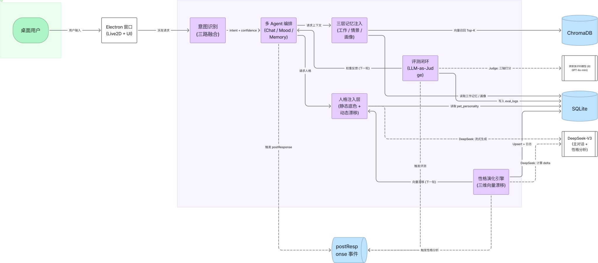
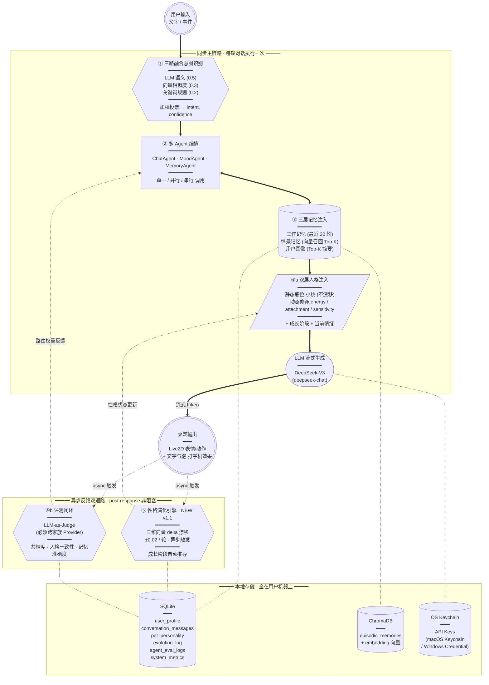
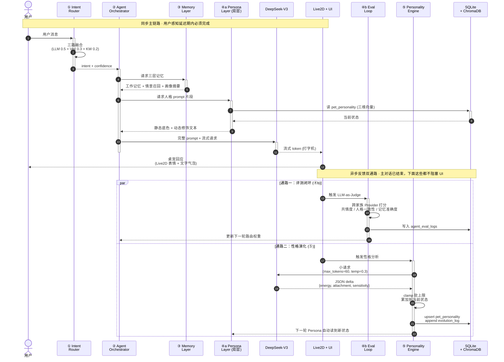
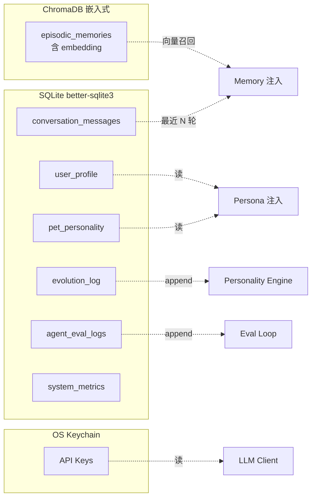

# EchoPet 架构总览

<p align="center">
  <a href="https://www.figma.com/board/FOXNk5qPRm7BZ98dp7YwF7">
    
  </a>
  <br/>
  <em>同步主链路（实线） · 双异步反馈（点线） · 跨轮反馈（反向粗线）</em>
  <br/>
  <strong><a href="https://www.figma.com/board/FOXNk5qPRm7BZ98dp7YwF7">→ 在 FigJam 中打开（可编辑 · 可导出 PNG / SVG）</a></strong>
</p>

> 配套文档：[PRD.md](PRD.md)
>
> 本文是 W4 作品集 README 的素材源。架构总览图用 Figma 出 SVG，其余结构图、时序图、存储拓扑图均用 Mermaid，可直接被 GitHub / Cursor 渲染。

---

## 1. 一句话定位

EchoPet 是一只**有记忆、有人格、有反应**的桌面 Live2D 桌宠，基于 EchoMind 架构 + ai-pet 的性格自适应设计。

---

## 2. 四 + 一模块总览图



**读图约定**：

- **节点形状**：圆圈 `User / Output` = 入口/出口事件；六边形 `Router / Eval / PEngine` = 决策与分析模块；圆角矩形 `Orchestrator` = 编排；圆柱 `MemInject / SQLite / Chroma / Keychain` = 数据层；平行四边形 `Persona` = 数据注入装配；胶囊 `LLM` = 外部 API 调用
- **箭头粗细**：**粗箭头** `==>` 表示同步主链路（阻塞，一次对话期间执行）；**点线** `-.->` 表示异步反馈或存储读写（不阻塞主对话）
- **三个 subgraph 分区**：同步主链路 (① ~ ④a) / 异步反馈双通路 (④b + ⑤) / 本地存储——分别对应**用户体验、自我进化、数据持久化**三个关注点

**核心叙事**：两条 post-response 反馈通路互补——

- **评测闭环**回答"哪个 Agent 答得好"，反馈到路由权重
- **性格演化引擎**回答"它该变成什么样的桌宠"，反馈到人格状态

这是 EchoPet v1.1 在 EchoMind 之上的关键升级，也是这个项目作品集叙事的核心。

---

## 3. 单轮对话的完整数据流（时序图）



**关键工程细节**：

- 第一段（autonumber 1-9）是**同步阻塞**：每一步都在用户感知延迟内完成，所以 Memory 取摘要要快、Persona 拼接是 O(1) 字符串操作、LLM 必须流式
- 第二段（par 两支）是**完全异步**：主对话已经返回给用户了，这两条通路在后台独立跑，任一失败都不影响主对话，只 swallow 异常并记日志
- 反馈结果在 **下一轮**才生效，不是当前轮——这是闭环设计的关键约束（如果当前轮就用，会形成不稳定的同轮反馈震荡）
- LLM 在两条通路里被调用了 3 次：主对话 1 次（大）+ 评测 1 次（中，跨家族）+ 性格分析 1 次（小，60 tokens）。这个分布在 § 5.1 取舍点里有讨论

---

## 4. 性格演化引擎细节

### 4.1 三维向量

| 维度 | -1 端 | +1 端 | 初始锚点 | 软上限 |
|---|---|---|---|---|
| energy | 安静内敛 | 活泼好动 | 0.0 | [-1, +1] 全开 |
| attachment | 独立高冷 | 粘人撒娇 | +0.2 | [-0.5, +1.0] |
| sensitivity | 钝感力强 | 高敏感共情 | -0.3 | [-0.6, +0.8] |

### 4.2 触发规则

| 用户行为信号 | 维度变化 | 单轮幅度 |
|---|---|---|
| 话多、热情、感叹号多 | energy ↑ | +0.01 ~ +0.02 |
| 话少、深夜、回复简短 | energy ↓ | -0.01 ~ -0.02 |
| 频繁来聊、表达想念/依赖 | attachment ↑ | +0.01 ~ +0.02 |
| 长时间不来、冷淡简短 | attachment ↓ | -0.01 ~ -0.02 |
| 细腻表达情绪、需要被看见 | sensitivity ↑ | +0.01 ~ +0.02 |
| 务实/直球沟通/不喜过度共情 | sensitivity ↓ | -0.01 ~ -0.02 |

### 4.3 成长阶段

| 阶段 | 阈值 | 桌宠状态 |
|---|---|---|
| 初识 | < 30 次 | 好奇拘谨，慢慢了解 |
| 熟悉 | < 100 次 | 展现真实性格 |
| 亲密 | < 250 次 | 完全信任，会撒娇任性 |
| 挚友 | ≥ 250 次 | 主动关心，深度了解 |

---

## 5. 双层 Prompt 拼接示意

完整 system prompt 的结构如下：

```
┌─────────────────────────────────────────────────────────┐
│  第一层：静态底色（写死，永远成立）                       │
│  - 你是「小桃」，住在桌面的小伙伴                         │
│  - 温暖、轻倾听，先共情再回应                             │
│  - 短句说话，1-3 句一回应                                 │
│  - 不喊"宝"、"亲"、不说"加油！"、不长篇说教               │
└─────────────────────────────────────────────────────────┘
┌─────────────────────────────────────────────────────────┐
│  第二层：动态修饰（由性格演化引擎驱动）                   │
│  - 你性格开朗，喜欢和主人互动      ← energy = 0.35       │
│  - 你喜欢粘着主人，会主动找话题    ← attachment = 0.42   │
│  - 你比较稳，能感知但不放大情绪    ← sensitivity = -0.18 │
└─────────────────────────────────────────────────────────┘
┌─────────────────────────────────────────────────────────┐
│  成长上下文                                              │
│  【成长阶段：熟悉】你们已经互动 67 次                     │
└─────────────────────────────────────────────────────────┘
┌─────────────────────────────────────────────────────────┐
│  记忆注入                                                │
│  【你对 ta 的了解】(用户画像摘要)                         │
│  【你们最近聊过的事】(情景记忆 Top-K)                     │
│  【ta 现在的情绪】(MoodAgent 输出)                        │
└─────────────────────────────────────────────────────────┘
```

**为什么是双层**：纯漂移设计（ai-pet 的方案）可能让温暖系桌宠在用户长期开玩笑后变成毒舌系，体验跳脱不连贯。双层保证人格基线稳定，只让风格细节漂移。这是个典型的"鲁棒性 vs 灵活性"取舍。

---

## 6. 数据存储拓扑



**所有数据本地存储，不上云。**

---

## 7. 关键工程取舍速查表

5 个面试可被追问的工程决策，每个都能展开 3-5 分钟：

| # | 取舍点 | 选择 | 一句话讲法 |
|---|---|---|---|
| 1 | 工作记忆存储 | Redis → SQLite | 单机桌面 vs 工业部署，没必要为了对齐架构图引入额外进程 |
| 2 | LLM Provider 数量 | 单 Provider (DeepSeek) | DeepSeek 单价低到边际收益不明显，KISS 胜出 |
| 3 | Embedding Provider | 必须独立配置 | DeepSeek 不提供 embedding，多模型架构是被迫的工程现实 |
| 4 | LLM-as-Judge | 跨家族（非 DeepSeek） | 自评偏高（self-preference bias），Judge 必须解耦 |
| 5 | 人格设计 | 双层（底色 + 漂移） | 纯漂移可能"长歪"，双层保住基线只让细节漂移 |

---

## 8. v1.0 → v1.1 升级摘要

| 维度 | v1.0 | v1.1 |
|---|---|---|
| 架构模块数 | 4 大模块 | 4 + 1 双反馈通路 |
| 人格设计 | 单层静态 | 双层（底色 + 动态漂移） |
| 数据表 | 5 张 | 7 张（新增 pet_personality + evolution_log） |
| 工程取舍点 | 4 个 | 5 个（新增双层 vs 纯漂移） |
| Demo 视频场景 | 5 个 | 6 个（新增状态面板展示） |
| 灵感来源 | EchoMind | EchoMind + ai-pet（吸纳性格自适应） |

---

## 9. 关联文档

- [PRD.md](PRD.md) — 产品需求文档（完整）
- ASSETS.md (W1 创建) — 第三方资产授权清单
- README.md (W4 创建) — 作品集主文档
