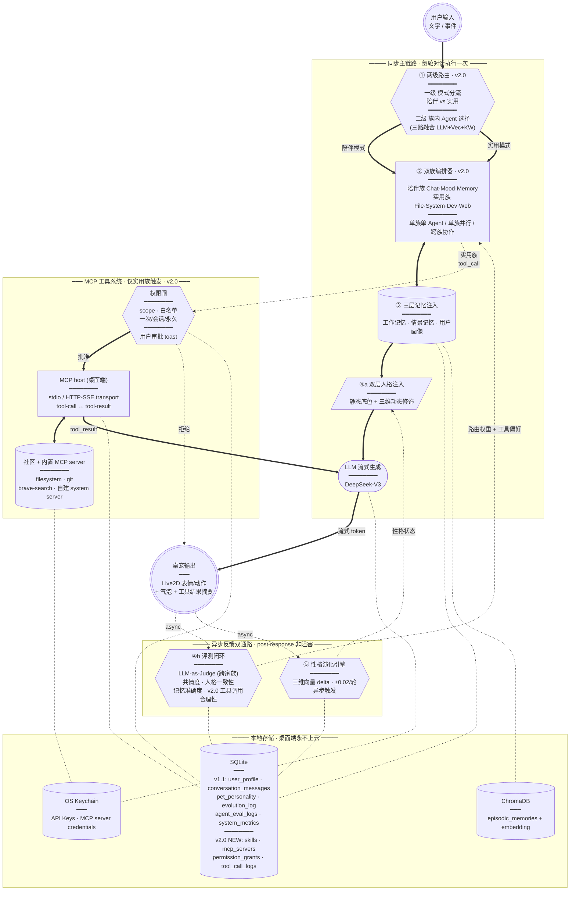

# EchoPet · 桌宠 PRD v2.1

> 基于 EchoMind 架构（多 Agent + 三路意图 + 三层记忆 + 评测闭环），吸纳 [ai-pet](https://github.com/) 的"性格自适应"，并在 v2.0 升级为**「双族 Agent + MCP 工具系统 + 三端体验」**的跨端情感陪伴 + 实用助手桌宠。v2.1 在 v2.0 双族架构上**简化陪伴族为单 CompanionAgent**，把工作 Agent 起骨架前移到 W3。
>
> 状态：**v2.1 锁定** · 定位：作品集导向 · 当前进度：W1 ✅ W2 ✅ · 下一步进入 W3
>
> 关键定调：人格"小桃"（温暖系，双层设计：静态底色 + 动态漂移） · Live2D 用官方 Hiyori · LLM 默认 DeepSeek · 工具协议 MCP · 部署 Vercel + Supabase
>
> ## 版本演进表
>
> | 维度 | v1.0 | v1.1 | v2.0 | **v2.1** |
> |---|---|---|---|---|
> | 架构模块数 | 4 大 | 4 + 1 双反馈通路 | 4 + 1 + 工具系统 | 同 v2.0 |
> | Agent 编排 | 三个陪伴 Agent | 三个陪伴 Agent | 双族（陪伴 3 + 实用 4） | **陪伴 1 + 实用 4**（CompanionAgent 单 Agent 内嵌情绪/记忆注入） |
> | LLM 调用 / 轮 | 1 主 | 1 主 | 3-4（多 Agent 并行） + 异步性格 | **1 主 + 异步性格 + 偶发工具**（成本/延迟显著降） |
> | 人格设计 | 单层 | 双层（底色 + 漂移） | 双层 | 双层 — 保留 |
> | 数据 / 工具 | 本地 | 本地 | 本地 + MCP + 权限审批 | 同 v2.0 |
> | 端 | Electron 桌面 | Electron 桌面 | 三端 | 同 v2.0 |
> | Backend | 无 | 无 | Supabase + Vercel（Web only） | 同 v2.0 |
> | 数据模型 | 5 表 | 7 表 | 桌面 11 + Web Supabase 独立 | 同 v2.0 |
> | 周期 | 4 周 | 4 周 | 9 周（V1 4 + V1.5 2 + V2 3） | **9 周不变，V1-V1.5 边界从串行变为部分并行** |
> | 灵感 | EchoMind | + ai-pet | + MCP 生态 | + 单 Agent 简化设计直觉 |
>
> **v2.0 → v2.1 关键升级**：
> 1. **陪伴族 = 1 个 CompanionAgent**：情绪识别 / 记忆调用全部转为 **prompt 内嵌指令 + 被动 RAG 注入**，不再有独立 MoodAgent / MemoryAgent
> 2. **工作 Agent 起骨架前移到 W3**：MCP host + FileAgent read-only 跟 V1 陪伴闭环**并行交付**
> 3. **里程碑微调**：W3 主线陪伴 + 副线工作骨架；W4 工作 Agent 完整闭环 + 权限审批；W5 评测 + V1 作品集（陪伴 + 工作双 demo）；V2 时间表不变
> 4. 复杂度与成本显著降低：单轮 LLM 调用次数从 3-4 降到 1（+ 1 异步性格分析）
>
> **v1.1 → v2.0 关键升级**（保留以方便上下文）：
> 1. 双族 Agent；2. MCP 工具系统；3. 三端策略；4. Backend 数据隔离原则

---

## 1. 项目背景与定位

### 1.1 背景
市面上的桌宠基本分两类：
- **纯动画类**（如经典桌面助手）：好看但是个"摆件"，没有任何记忆和上下文。
- **套壳聊天类**：接了 LLM，但每次都是空白上下文，"我是谁"靠 system prompt 硬撑，三句话就穿帮。

两类都没解决一个核心问题：**陪伴感的本质是"它记得我"**。

### 1.2 产品定位（v2.0 升级）

**EchoPet 是一个既能陪你聊天、又能帮你干活的桌面 Live2D 小伙伴。**

不是"放在桌面的 ChatGPT"，而是：
- 它知道你昨天加班到 1 点（**情景记忆**）；
- 它记得你养了一只叫"煤球"的猫（**用户画像**）；
- 你说"帮我把 Desktop 上的截图按月份分类" → 它**真的去动文件**（**实用族 Agent + MCP filesystem 工具**）；
- 你说"我今天好累" → 它切担心表情、追问"是因为下午那个 bug 吗"（**陪伴族 Agent + 情景记忆**）；
- 你换台机器登录 Web 版试玩 → 那是独立的"试玩账号"，**不会**碰到你桌面端的私人记忆（**三端数据隔离**）。

### 1.3 一句话价值主张

> "一只真的记得你、还能帮你干活的桌面小伙伴。"

### 1.4 目标用户

| 用户群 | 痛点 | EchoPet 解决 |
|---|---|---|
| 独居/远程办公的开发者 | 桌面孤单、缺少轻量陪伴 | 始终在屏幕一角的有反应的小伙伴 |
| 喜欢二次元/虚拟形象的用户 | 现有 Live2D 桌宠只动不聊 | Live2D + 有记忆的对话 |
| 重度 AI/Cursor/Claude 用户 | 想要一个常驻桌面的 MCP 入口 | 桌宠 = MCP host，挂任意 MCP server，工具调用全程透明可审批 |
| AI 产品/技术爱好者 | 想看真实落地的多 Agent + 工具系统项目 | 双族 Agent + MCP 集成 + 三端跨平台 |

### 1.5 非目标（明确不做）

- ❌ 通用生产力助手（不抢 Raycast/Notion AI 的活，定位是"有人格的工具入口"而非"工具大全"）
- ❌ 屏幕感知 / 截图分析（V3 再考虑）
- ❌ 语音对话（V3，先把文字 + 工具闭环跑稳）
- ❌ 多用户云同步（桌面端永远单机单用户；Web/Mobile 端独立账号且**不与桌面端互通**）
- ❌ 自营 MCP server（v2.0 桌宠是 MCP **host/client**，不做自己的 server，依赖社区生态）

---

## 2. 核心场景 & 用户故事

### 场景 1：日常打招呼
> 用户早上打开电脑 → EchoPet 出现并播放"伸懒腰"动作 → 主动说："早安，昨天你说今天有个 demo，准备好了吗？"

✅ 触发能力：**主动行为** + **情景记忆调用**

### 场景 2：情绪低落
> 用户输入"今天好烦"→ 桌宠切换"担心"表情 → 不是说"加油！"，而是说："是因为下午那个 bug 还没解吗？还是别的事？"

✅ 触发能力：**情绪 Agent 介入** + **最近上下文记忆**

### 场景 3：分享日常
> 用户："煤球又把我键盘踩了" → 桌宠："那只小坏蛋哈哈，上次它还把你水杯打翻过吧" → 用户感受到"它真的记得"

✅ 触发能力：**用户画像（宠物名）** + **情景记忆（历史事件）**

### 场景 4：闲聊变深聊
> 用户漫无目的聊了 20 分钟 → Monitor 检测对话情感曲线持续下行 → 桌宠主动切换"倾听者"人格

✅ 触发能力：**监控闭环** → **Agent 自动降级/切换**

### 场景 5（v2.0 新增）：让它帮我整理 Desktop

> 用户："Desktop 上那一堆截图帮我按月份分类下"
> → Router 判定为**实用模式** + 路由到 **FileAgent**
> → 状态机进入 `thinking → acting`，气泡显示「我先看一下你的 Desktop 里有什么…」
> → **权限审批 toast 弹出**：「FileAgent 想要 `read` 你的 `~/Desktop`，是否允许？[一次] [本次会话] [永久] [拒绝]」
> → 用户点"本次会话"
> → MCP filesystem server 调用 `list_directory` + `move_file` 完成分类
> → 桌宠切回 `speaking` 总结："分了 6 月、7 月、8 月三个文件夹，截图都搬过去啦"

✅ 触发能力：**两级路由** + **MCP filesystem 工具** + **权限审批 UX** + **状态机 acting sub-state**

### 场景 6（v2.0 新增）：Web 版在线试玩

> 朋友点开作品集 README 里的 `echopet.app` 链接 → 看到 Hiyori + 一个"试玩"按钮
> → 点击 → 用 GitHub OAuth 一键登录 → 创建独立试玩账号
> → 自带 DeepSeek key 或使用平台体验配额（每天 20 轮）
> → 体验完整陪伴对话（陪伴族 Agent 全开）+ 受限实用族（只读 Web 浏览，不能动文件）
> → **此账号数据完全独立**，桌面端用户的私人记忆不会被任何 Web 用户看到

✅ 触发能力：**PWA 跨端** + **Supabase Auth + RLS 数据隔离** + **Skills 在 Web 端按 capability 自动裁剪**

---

## 3. 功能范围（v2.0 三阶段 + V3 路线图）

### 3.1 V1 · 情感陪伴闭环（4 周，桌面端，**W1-W2 ✅ / W3-W4 进行中**）

| 模块 | 功能 | 优先级 | 状态 |
|---|---|---|---|
| 桌宠形象 | Live2D 模型加载、5 种基础表情、3 种动作（站立/伸懒腰/睡觉） | P0 | ✅ W1 |
| 桌宠形象 | 透明窗口、置顶、拖拽移动、点击唤起对话 | P0 | ✅ W1-W2 |
| 对话 | 文字聊天气泡输入框 | P0 | ✅ W2 |
| 对话 | 流式输出 + 打字机效果 | P0 | ✅ W2 |
| 状态机 | 6 状态 XState v5 驱动 motion + UI | P0 | ✅ W2 |
| 单 CompanionAgent | 单 Agent + 情绪 prompt 内嵌 + 三层记忆被动注入（v2.1 简化） | P0 | 🟡 W3 |
| 意图识别 | 三路融合（LLM + 向量 + 关键词） | P0 | 🟡 W3 |
| 记忆 | 工作记忆（最近 N 轮，本地 SQLite） | P0 | 🟡 W3 |
| 记忆 | 情景记忆（ChromaDB 存储事件） | P0 | 🟡 W3 |
| 记忆 | 用户画像（结构化 JSON：昵称/喜好/重要日期/宠物等） | P0 | 🟡 W3 |
| **性格演化** | **三维向量（energy / attachment / sensitivity）异步漂移 + 4 段成长阶段** | **P0** | 🟡 W3 |
| 主动行为 | 定时关怀（久坐/晚安/早安） | P1 | 🟡 W4 |
| 评测 | LLM-as-Judge：共情度 / 人格一致性 / 记忆准确度 | P1 | 🟡 W4 |
| 监控 | 响应延迟、token 成本、情感曲线、Agent 调用分布 | P1 | 🟡 W4 |
| **状态面板** | **性格条 + 成长阶段 + 互动次数 + 当前心情 + 记忆要点** | **P1** | 🟡 W4 |
| 设置 | 模型/API Key 配置、人格名字/称呼配置、记忆管理 | P1 | 🟡 W2 雏形 + W4 完善 |

### 3.2 V1.5 · 实用 Agent 族 + MCP 工具系统（v2.1：W3 副线起骨架 + W4 完整闭环）

| 模块 | 功能 | 优先级 | 落地周 |
|---|---|---|---|
| **MCP host (骨架)** | `@modelcontextprotocol/sdk-node` + stdio transport + schema cache + DeepSeek FC bridge | P0 | **W3 副线** |
| **状态机扩展** | `thinking` 拆 `acting/observing/awaiting-approval` sub-state（一次写完） | P0 | **W3 副线** |
| **两级路由（一级）** | 陪伴 vs 实用二分类（关键词 + LLM zero-shot 兜底） | P0 | **W3 副线** |
| **FileAgent (read-only)** | 挂 `@modelcontextprotocol/server-filesystem`，白名单 `~/Desktop`，跑通 E2E demo | P0 | **W3 副线** |
| **FileAgent (write)** | 加 `write` scope 经审批 | P0 | W4 |
| **SystemAgent** | 剪贴板读写、系统通知、屏幕分辨率（自建内置 stdio server） | P0 | W4 |
| **DevAgent** | 基于社区 `mcp-server-git` 操作 git 仓库 | P1 | W4 |
| **WebAgent** | 基于社区 `brave-search` 或 `tavily` MCP server 网页搜索 | P1 | W4 |
| **两级路由（二级 · 实用族）** | 实用模式下选具体 Agent + tools_hint | P0 | W4 |
| **ReAct loop** | thinking → acting → observing → 收敛或继续 | P0 | W4 |
| **Skills 系统** | 4 个预设包：开发者助手 / 文件管家 / 研究助手 / 裸装 | P0 | W4 |
| **权限模型** | scope 四档（read / write / exec / network）+ 一次/会话/永久 | P0 | W4 |
| **审批 UX** | 工具调用前弹 toast + 桌宠询问态 motion + 默认拒绝兜底 | P0 | W4 |
| **设置三 tab** | Skills / Tools / Permissions | P0 | W4 |

### 3.3 V2 · Web PWA + Backend + 在线体验（3 周，W7-W9）

| 模块 | 功能 | 优先级 |
|---|---|---|
| **Web PWA** | 复用 `packages/state-machine` + `packages/agent-core`，Live2D 升级到 PixiJS v7 ESM | P0 |
| **Service Worker** | 离线缓存（资源 + 静态人格）；运行时数据走 Supabase | P1 |
| **Supabase Auth** | GitHub OAuth + Email magic link，独立 user_id | P0 |
| **Supabase Postgres** | 启用 pgvector，存 conversation / personality / evolution_log / agent_eval_logs；RLS 强制 user_id 隔离 | P0 |
| **Vercel API Routes** | 桥接 LLM 调用（用户可选「自带 key」或「平台体验配额」） | P0 |
| **数据隔离原则** | 桌面端 ↔ Web 端**零数据流通**，不提供"导入" UI（避免用户误操作泄露隐私） | **P0** |
| **Skills 在 Web 端裁剪** | Web 默认禁用 `write` / `exec` scope；FileAgent 只能挂"在线沙箱目录"（如 Supabase Storage） | P0 |
| **在线体验配额** | 平台 key 模式每日 20 轮，超出引导用户配置自己的 key | P1 |
| **作品集主页** | `echopet.app` 着陆页 → 一键试玩 + 嵌入 demo 视频 + 项目文档导航 | P1 |

### 3.4 V3+ 路线图（不在 v2.0 范围）

- 🔮 Mobile 原生（React Native + Live2D Native SDK）
- 🔮 语音 ASR / TTS / LipSync
- 🔮 屏幕感知 / 剪贴板感知 / OCR
- 🔮 多桌宠形象（设置页切换 Hiyori / 自有模型）
- 🔮 用户喂食 / 抚摸 / 装扮等萌系互动
- 🔮 自定义 Live2D 模型导入
- 🔮 桌面端 ↔ Web 端**手动**数据导出/导入（v2.0 故意不做，留给 V3 视用户呼声决定）

---

## 4. 核心架构（双族 Agent + 工具系统 + 双反馈通路）

v2.0 在 v1.1 「四 + 一双反馈通路」基础上，加入第二条 Agent 主干——**实用族**（基于 MCP 协议的工具型 Agent），形成双族编排。原有"评测闭环 + 性格演化"双反馈通路保留。

- **陪伴族**（v1.1 已锁定）：Chat / Mood / Memory，回答情感、记忆、闲聊
- **实用族**（v2.0 NEW）：File / System / Dev / Web，通过 MCP 协议挂载社区工具 server，执行真实操作
- **两级路由**：一级先判定模式（陪伴 vs 实用），二级在族内选具体 Agent
- **统一权限闸**（v2.0 NEW）：所有工具调用必须经过权限审批层 ——「scope · 目录白名单 · 一次/会话/永久」三粒度
- **评测闭环 + 性格演化** 双反馈通路（v1.1）保留



**读图说明**：

- **节点形状**约定：圆圈 `User / Output` = 入口/出口；六边形 `Router / Eval / PEngine / PermGate` = 决策类；圆角矩形 `Orchestrator / MCPHost` = 编排执行；圆柱 = 数据层；平行四边形 `Persona` = 注入；胶囊 `LLM` = 外部调用
- **箭头粗细**：**粗箭头** `==>` 同步主链路；**点线** `-.->` 异步反馈或存储读写
- **subgraph 四个分区**：同步主链路 / **MCP 工具系统（v2.0 NEW）** / 异步反馈双通路 / 本地存储

**双族协作叙事**：

- 用户问"今天好累" → Router 判**陪伴模式** → Orchestrator 调 Mood + Memory → 路径同 v1.1，不碰 MCP
- 用户问"帮我整理桌面" → Router 判**实用模式** → Orchestrator 调 FileAgent → PermGate 审批 → MCPHost 调 filesystem MCP server → 结果回到 LLM → 生成总结
- 用户问"昨天我说的那个项目，帮我打开看看" → **跨族**：Memory 召回"那个项目"路径 + Dev 用 git MCP 打开仓库 → 联合输出

### 4.1 模块一：双族 Agent 编排

#### 4.1.1 陪伴族（Companion Family，**v2.1 简化为单 CompanionAgent**）

v1.1 / v2.0 设计了三个并行陪伴 Agent（Chat / Mood / Memory），v2.1 简化为 **1 个 CompanionAgent**，把原三 Agent 的能力压成单次 LLM 调用：

| 能力 | v2.0 实现 | **v2.1 实现** |
|---|---|---|
| 主对话 + 共情 | ChatAgent | CompanionAgent 主调用 |
| 情绪识别 + 风格切换 | MoodAgent 独立 LLM 调用 | **prompt 内嵌指令**：「先识别 ta 当前情绪 → 用对应风格回应」，主调用一次完成 |
| 历史事件回忆 | MemoryAgent 独立判断 + 召回 | **被动 RAG 注入**：每轮主调用前向量召回 Top-K，作为 `{recent_episodic_memories}` 注入 prompt |
| 用户画像感知 | 各 Agent 各自读 | 主调用前从 `user_profile` 取摘要注入 prompt |

**为什么简化**：

- LLM 调用次数从 3-4 次/轮 降到 **1 次/轮 + 1 次异步性格分析**，成本、延迟显著下降
- 状态机不需要"多 Agent 结果合并"复杂度
- 单 Agent prompt 直接拼接所有上下文，**信息无损**（多 Agent 模式下情绪/记忆信号要二次序列化才能交给最终 ChatAgent，反而失真）
- 代价：损失结构化情绪数据（情感曲线）。W5 评测时复盘是否需要拆出 emotion-extractor 子调用

**单调用 prompt 拼接顺序**：人格底色 → 性格动态修饰 → 成长上下文 → 用户画像 → 情景记忆 → 工作记忆（最近 N 轮）→ 当前用户输入 + 内部步骤指令（识别情绪 → 决定风格 → 回应）。完整模板见 §4.7.3。

#### 4.1.2 实用族（Utility Family，v2.0 NEW）

| Agent | 职责 | 挂载的 MCP server | 默认 scope |
|---|---|---|---|
| **FileAgent** | 读写本地文件、按规则批处理（整理 / 重命名 / 分类） | [`@modelcontextprotocol/server-filesystem`](https://github.com/modelcontextprotocol/servers/tree/main/src/filesystem) | read（默认）/ write（白名单目录 + 审批） |
| **SystemAgent** | 剪贴板、系统通知、屏幕分辨率、应用切换 | 自建 stdio server（基于 Node） | read（默认）/ write（审批） |
| **DevAgent** | git 状态 / log / diff / commit / branch 操作 | [`mcp-server-git`](https://github.com/modelcontextprotocol/servers/tree/main/src/git) | read（默认）/ exec（审批） |
| **WebAgent** | 网页搜索、抓取摘要 | `brave-search` / `tavily` MCP server | network（默认） |

**编排模式**：

- **单 Agent 单步**：「打开我的 ~/Projects」→ FileAgent.list → 直接出结果
- **单 Agent ReAct loop**（多步）：「把 Desktop 截图按月分类」→ FileAgent.list → FileAgent.mkdir × 3 → FileAgent.move × N → 汇总
- **跨族协作**（v2.1 简化版）：「我昨天提到的那个项目，把它的 git status 给我」→ CompanionAgent 注入位拿到 episodic 召回的"那个项目"路径 → 路由判定实用模式 → DevAgent.git_status → CompanionAgent 用陪伴口吻包装输出

#### 4.1.3 状态机扩展（适配 ReAct loop）

W2 的 6 状态在 V1.5 扩展为：

```
idle → listening → thinking → ┬─ speaking → done             (陪伴模式，同 W2)
                              │
                              └─ acting → observing → thinking ⟲   (实用模式 ReAct loop)
                                            │
                                            ├─ user.deny → apologetic
                                            └─ tool.error → apologetic
```

- `acting`：调 PermGate + MCP tool 中。气泡显示「正在让 FileAgent 看一下…」+ 桌宠"侧头"motion
- `observing`：拿到 tool_result，喂回 LLM 决定下一步。气泡保持当前内容，桌宠 idle
- 多步 ReAct loop 不超过 `MAX_STEPS=8` 上限，超出强制收敛到 `apologetic`

### 4.2 模块二：两级路由（v2.0 升级）

| 级别 | 任务 | 实现 | 输出 |
|---|---|---|---|
| **一级** | 陪伴 vs 实用模式分流 | 关键词正则（动词「帮我」「打开」「整理」+ 目标实体） + LLM zero-shot 兜底 | `mode: "companion" / "utility"` |
| **二级 · 陪伴模式** | 选 Chat / Mood / Memory（可并行） | v1.1 三路融合（LLM 0.5 + Vec 0.3 + KW 0.2） | `agents: [...]` |
| **二级 · 实用模式** | 选 File / System / Dev / Web（通常单选） | LLM 选 + 二级关键词补强（"git" → DevAgent、"剪贴板" → SystemAgent） | `agent: ..., tools_hint: [...]` |

**输出 schema**：

```ts
type RouterResult =
  | { mode: 'companion'; intent: string; confidence: number; agents: AgentName[] }
  | { mode: 'utility'; intent: string; confidence: number; agent: AgentName; tools_hint?: string[] }
```

**意图集合（v2.0）**：
- 陪伴：`daily_chat / emotional_share / memory_recall / greeting / farewell`
- 实用：`file_op / system_op / dev_op / web_search`
- 元：`config_change / unknown`

### 4.3 模块三：RAG + 三层记忆

| 层 | 内容 | 存储 | 调用时机 |
|---|---|---|---|
| **工作记忆** | 最近 20 轮对话 | 内存 / SQLite | 每次都注入 |
| **情景记忆** | 历史聊天事件（摘要后） | ChromaDB | 向量召回 Top-K |
| **用户画像** | 结构化档案：昵称、口头禅、重要日期、宠物、MBTI、喜好等 | SQLite + JSON | 每次注入摘要 |

**写入策略**：
- 工作记忆：每轮 append
- 情景记忆：每 N 轮或对话结束时，由一个"摘要 Agent"提炼为"事件卡片"写入（避免向量库爆炸）
- 用户画像：监测到新事实（"我妈下周生日"、"我新养了只猫"）时由 LLM 提取并 upsert

### 4.4 模块四：评测 & 监控闭环

**`/eval` 接口**：用 LLM-as-Judge 离线/在线评估三项指标
- **共情度**（0-5）：回应是否切中情绪
- **人格一致性**（0-5）：是否符合设定的人格风格
- **记忆调用准确度**（0-5）：被调用的历史事件是否真的相关

**`Monitor` 实时采集**：
- 响应延迟（P50/P95）
- Token 成本（累计 + 每 Agent）
- 每个 Agent 的调用次数 & eval 平均分
- 用户情感曲线（按天聚合）
- **自动降级**：某 Agent 连续 N 次评分 < 3 → 降低其路由权重，触发 alert

### 4.5 模块五：性格演化引擎（吸纳自 ai-pet）

EchoMind 的"用户画像"是**事实型记忆**（用户养了猫、是后端开发），但桌宠侧自己"变成什么样的桌宠"是另一个独立维度——这是 ai-pet 解决的问题，v1.1 把它正式纳入 EchoPet 架构。

性格演化引擎是 post-response 的**异步、非阻塞**模块，每轮对话结束后独立运行一次轻量 LLM 调用，分析用户行为信号，输出小幅度 delta，累计漂移到桌宠人格状态上。

#### 4.5.1 三维向量（已锁定）

| 维度 | -1 端 | +1 端 | 初始锚点 | 软上限 | 设计意图 |
|---|---|---|---|---|---|
| **energy** | 安静内敛 | 活泼好动 | 0.0 | 全开 [-1, +1] | 反映用户话密度/活跃度 |
| **attachment** | 独立高冷 | 粘人撒娇 | +0.2 | [-0.5, +1.0] | 反映用户互动频率/依赖度 |
| **sensitivity** | 钝感力强 | 高敏感共情 | -0.3 | [-0.6, +0.8] | 反映用户对共情的需求强度 |

**为什么 sensitivity 替换了 ai-pet 的 sharpness**：EchoPet 是温暖陪伴系，毒舌度和底色冲突。sensitivity（敏感度）更贴合——高敏感 = 细腻感知用户情绪，低敏感 = 稳定的钝感力陪伴，两端都是"温暖"的不同表达。

**为什么初始锚点偏温柔**：温暖系桌宠不能完全反转人格底色。轻度粘人 (+0.2) + 轻度钝感 (-0.3) 是"小桃"的起点；钝感让她不戏精，可漂移让她能跟随用户风格。

#### 4.5.2 演化触发规则

| 用户行为信号 | 维度变化 | 单轮幅度 |
|---|---|---|
| 话多、热情、感叹号多 | energy ↑ | +0.01 ~ +0.02 |
| 话少、深夜、回复简短 | energy ↓ | -0.01 ~ -0.02 |
| 频繁来聊、表达想念/依赖 | attachment ↑ | +0.01 ~ +0.02 |
| 长时间不来、冷淡简短 | attachment ↓ | -0.01 ~ -0.02 |
| 细腻表达情绪、需要被看见 | sensitivity ↑ | +0.01 ~ +0.02 |
| 务实/直球沟通/不喜过度共情 | sensitivity ↓ | -0.01 ~ -0.02 |

每轮通常只有 1-2 个维度发生变化，不是全员漂移。相比 ai-pet 的 ±0.03，我们略保守用 ±0.02，让漂移更稳健。

#### 4.5.3 成长阶段（基于互动总数）

| 阶段 | 阈值 | 桌宠状态 |
|---|---|---|
| 初识 | < 30 次 | 好奇、拘谨，慢慢了解 |
| 熟悉 | < 100 次 | 展现真实性格，相处自在 |
| 亲密 | < 250 次 | 完全信任，会撒娇会任性 |
| 挚友 | ≥ 250 次 | 主动关心，深度了解 |

阈值比 ai-pet 上调（30/100/250 vs 10/50/150），因为桌宠是高频日常应用，单日交互次数可达数十次。

#### 4.5.4 delta 计算流程（伪代码）

```python
async def analyze_and_evolve(user_msg, assistant_reply):
    state = db.get_personality()
    
    prompt = ANALYSIS_PROMPT.format(
        energy=state.energy,
        attachment=state.attachment,
        sensitivity=state.sensitivity,
        user_msg=user_msg[:200],
        assistant_reply=assistant_reply[:200],
    )
    
    raw = await deepseek.chat(
        prompt, max_tokens=60, temperature=0.3, timeout=5s
    )
    
    try:
        delta = json.loads(extract_json(raw))
    except:
        return None
    
    new_state = {
        "energy":      clamp(state.energy      + delta.energy,      -1.0, +1.0),
        "attachment":  clamp(state.attachment  + delta.attachment,  -0.5, +1.0),
        "sensitivity": clamp(state.sensitivity + delta.sensitivity, -0.6, +0.8),
    }
    
    db.update_personality(new_state)
    db.append_evolution_log({
        ts: now(), delta, trigger_msg: user_msg[:50]
    })
```

**关键工程细节**：
- 完全异步：在主回复 stream 完成后才触发，不阻塞 UI
- 失败容忍：任何异常都 swallow，性格分析失败 ≠ 对话失败
- 软上限不同维：energy 全开（用户性格可能很跳脱），attachment 和 sensitivity 收紧（保住温暖底色）
- 每次写入都 append `evolution_log`，作品集 demo 可画"性格漂移轨迹图"

#### 4.5.5 性格状态 vs 用户画像 的关系

这是新模块和原 § 4.3 用户画像的语义区分（面试可被追问）：

| 维度 | 用户画像（§ 4.3） | 性格状态（§ 4.5） |
|---|---|---|
| 描述对象 | 用户是什么样的人 | 桌宠变成什么样的桌宠 |
| 类型 | 事实型（养煤球、后端开发、北京） | 关系型（粘人度 0.4、敏感度 0.1） |
| 更新方式 | LLM 抽取新事实 → upsert | 异步分析 → 微 delta 累加 |
| 表达层 | 注入 prompt 的"你对 ta 的了解" | 注入 prompt 的"你现在的性格" |
| 用户可改 | 是，记忆管理面板 | 是，状态面板可重置 |

两者并存且互补，对应 EchoPet 双向"它记得我 / 它变成了我塑造的样子"的陪伴感来源。

---

### 4.6 模块六：MCP 工具系统 + Skills + 权限（v2.0 NEW）

实用族 Agent 不自己实现工具，全部通过 **MCP (Model Context Protocol)** 协议挂载 — 桌面端做 MCP **host/client**，社区 / 内置 MCP server 是工具的实际执行方。

#### 4.6.1 为什么选 MCP（取舍点 6）

| 备选 | 优势 | 劣势 |
|---|---|---|
| **MCP (Anthropic 标准)** ✅ | 生态成熟（filesystem / git / sqlite / brave-search / GitHub 等社区 server 已就绪）；可对接 Cursor / Claude Desktop，**作品集可讲性极强**；transport 抽象（stdio / HTTP-SSE / WebSocket）便于桌面端集成 | 协议演进中，需要跟版本；DeepSeek 不原生支持，需在 host 侧做 function calling 适配 |
| OpenAI Function Calling | DeepSeek 原生支持 schema；上手快 | 工具实现自己写，没生态；自家 schema 锁定 |
| LangChain Tools | Python 生态丰富 | 桌面 Electron 集成成本高（需 sidecar）；社区评价是"快糙猛"工程级别低 |
| 完全自定义 | 全自由 | 失去所有标准化福利，作品集叙事弱 |

**最终选 MCP**：作品集场景下"我做了一个能挂任意 MCP server 的桌宠"叙事强度 > 其他所有方案。DeepSeek 不原生支持的缺口在 host 层做 function-calling shim 解决（详见 §4.6.2 桥接层）。

#### 4.6.2 MCP host 实现要点

```
┌──────────────────── EchoPet Desktop (Electron main) ────────────────────┐
│                                                                          │
│  Renderer (React)                                                        │
│       │                                                                  │
│       │ IPC: mcp.list / mcp.invoke / permission.request                  │
│       ▼                                                                  │
│  Main Process                                                            │
│  ├─ MCP Host Layer (基于 @modelcontextprotocol/sdk-node)                  │
│  │    ├─ ServerRegistry  (mcp_servers 表 + 配置文件)                     │
│  │    ├─ Transport pool                                                  │
│  │    │    ├─ StdioClient × N   (本地进程 npx mcp-server-…)              │
│  │    │    └─ SseClient × N     (远程 https://… MCP server)              │
│  │    ├─ Schema cache    (tool list / input schema, 启动时拉取并缓存)     │
│  │    └─ Bridge to LLM   (MCP tool → DeepSeek function calling schema)   │
│  │                                                                       │
│  ├─ PermissionGate                                                       │
│  │    ├─ scope check  (read / write / exec / network)                    │
│  │    ├─ path whitelist (FileAgent 用)                                   │
│  │    └─ grant store  (permission_grants 表)                             │
│  │                                                                       │
│  └─ ToolCallLogger  (tool_call_logs 表，审计 + Eval 用)                   │
└──────────────────────────────────────────────────────────────────────────┘
```

**关键工程细节**：

- **Transport 启动**：stdio server（如 `npx -y @modelcontextprotocol/server-filesystem`）由 host 进程 spawn，stderr 转 ToolCallLogger；HTTP-SSE 用 fetch + EventSource 兼容层
- **Schema 缓存**：启动时一次性 `tools/list`，cache 到 SQLite + 内存；user 在设置页"刷新"才重新拉，避免每轮对话握手开销
- **Bridge to LLM**：MCP 的 `Tool` schema → OpenAI function calling 风格 → DeepSeek `tools` 字段。Tool 调用结果作为 role=tool 的 message 喂回 LLM 继续生成
- **失败模式**：MCP server 崩 → 自动 1 次重启，再崩标记为 `degraded`，从下一轮 Tool 选择中剔除直到下次启动

#### 4.6.3 Skills（预设包）

**Skill = 一组 MCP server + Prompt 模板 + 默认权限组合**，是给用户的"一键启用"封装。

| Skill 内置包 | 包含的 MCP server | 提示词偏向 | 默认权限 |
|---|---|---|---|
| 🧑‍💻 **开发者助手** | `mcp-server-git` + `mcp-server-filesystem`(白名单 `~/Projects`) + `brave-search` | DevAgent + FileAgent 偏好；提示词强调 git workflow 礼貌 | read + 项目目录 exec/write 审批 |
| 📁 **文件管家** | `mcp-server-filesystem`(白名单 `~/Desktop`, `~/Downloads`) | FileAgent 主导；用人话总结操作 | read + write（白名单内） |
| 🔍 **研究助手** | `brave-search` + 自建 `mcp-fetch` | WebAgent 主导；强调引用来源 | network only |
| 🌱 **裸装**（默认） | 仅内置 SystemAgent | 纯陪伴族 + 剪贴板 / 通知 | read only |

**Skill 安装**：v1.5 仅"内置 4 个"。v2.0 Web 端开放"自定义 Skill JSON"导入（但实用族大部分能力被 Web 端 scope 限制裁掉）。
**用户视角**：设置 → Skills tab → 勾选启用。底层在 `skills` 表里 upsert 一行 + 把对应的 `mcp_servers` 行设为 enabled。

#### 4.6.4 权限模型

**scope 四档**：

| Scope | 含义 | 举例 |
|---|---|---|
| `read` | 只读：列目录、读文件、读 git status | filesystem.list / git.status |
| `write` | 修改本地：建/移/改文件、写剪贴板 | filesystem.write_file / clipboard.write |
| `exec` | 执行：shell / git commit / 进程操作 | git.commit / shell.run |
| `network` | 出站网络 | brave-search.query |

**授权粒度三档**：

- **一次性**：本次工具调用，下一次同 scope 同目标仍要审批
- **本次会话**：进程存活期间不再审批同 (scope, target_pattern) 组合
- **永久**：写入 `permission_grants` 表，下次启动仍然有效；设置 → Permissions tab 可随时撤销

**审批 UX 时序**：

```
LLM 决定调 FileAgent.write_file(path="~/Desktop/screenshots/...")
   ↓
PermGate 查询 grants 表
   ↓
   ├─ 命中且 active → 直接放行（状态机不切，无感）
   │
   └─ 未命中或已撤销 → 状态机进入 awaiting-approval sub-state
                      ↓
        桌宠表情 → "询问态"（轻微歪头 motion）
        气泡显示："要不要让我写文件到 ~/Desktop/screenshots/ ？"
        弹 toast：[本次] [本会话] [永久] [拒绝]
                      ↓
        ├─ 批准 → 写 grants 表（如选永久）→ 继续工具调用
        ├─ 拒绝 → tool_call 标记 denied → 状态机进 apologetic → "好，不动了"
        └─ 30 秒无响应 → 默认 拒绝 + apologetic
```

**审计**：每次 tool_call 不论成功失败都写 `tool_call_logs` 表，设置 → Permissions tab 可看「最近 100 条工具调用」+ 一键导出 JSON。

#### 4.6.5 设置面板：三个新 tab

v2.0 在 W2 既有的「桌宠 / 性格 / 模型」之外增加：

| Tab | 内容 | 用户操作 |
|---|---|---|
| **Skills** | 4 个内置包卡片，每个有"已启用 / 未启用"开关 + 简介 + 包含的 server 列表 | 切换 ON/OFF |
| **Tools** | 当前激活的 MCP server 列表（名称 / transport / 启动命令 / 健康状态 / 工具数） | 手动添加 server / 重启 / 移除 |
| **Permissions** | ① grants 表 — 已授权清单 + 撤销按钮  ② tool_call_logs 表 — 审计日志（可筛选 agent / scope / time） | 撤销 grant / 导出审计 JSON |

#### 4.6.6 数据表（v2.0 NEW，桌面端 SQLite）

```
skills:                  id, name, enabled, included_servers[], prompt_addon, created_at
mcp_servers:             id, name, transport (stdio/sse), command/url, args[], env{},
                         capabilities[], status (running/stopped/degraded), last_ping_at
permission_grants:       id, scope, target_pattern, granted_at, expires_at (null=永久),
                         revoked_at, agent_name, server_id
tool_call_logs:          id, ts, agent_name, server_id, tool_name, args_summary,
                         result_summary, ok, latency_ms, denied_reason
```

---

### 4.7 人格设定（"小桃"· 双层设计）

v1.0 的单层人格在 v1.1 重构为**双层结构**：静态底色（不漂移）+ 动态修饰（性格演化引擎驱动）。

#### 4.7.1 第一层：静态底色（写死，不参与漂移）

- **代号**：小桃（可在设置页改名）
- **类型**：温暖陪伴系，"住在桌面的小伙伴"而非"AI 助手"
- **核心调性**（永远成立的属性）：
  - 温暖、轻倾听，先共情再回应
  - 记得用户的小事并在合适时主动提起
  - 短句为主，单次回应 1-3 句
  - 有自己的小情绪：被冷落会嘟嘴，被夸会开心
  - 不用 emoji 堆砌、不用感叹号轰炸

#### 4.7.2 第二层：动态修饰（由 § 4.5 性格状态映射）

每个三维向量值映射到 4 段描述文本（参考 ai-pet 的 prompt-builder.js 模式）：

```
energy ∈ [-1, -0.5]   → 你性格安静内敛，喜欢安静陪伴，说话轻声细语
energy ∈ [-0.5, 0]    → 你比较文静，偶尔活泼，不排斥玩闹
energy ∈ [0, 0.5]     → 你性格开朗，喜欢和主人互动，会主动找话题
energy ∈ [0.5, 1]     → 你超级活泼好动，话多精力旺盛

attachment ∈ [-1, -0.5] → 你比较独立，不太主动找主人
attachment ∈ [-0.5, 0]  → 你有点傲娇，嘴上不说但很在意
attachment ∈ [0, 0.5]   → 你喜欢粘着主人，会主动找话题
attachment ∈ [0.5, 1]   → 你超级粘人，时刻想得到关注

sensitivity ∈ [-1, -0.5] → 你钝感力强，不过度解读主人的情绪，给稳定踏实感
sensitivity ∈ [-0.5, 0]  → 你比较稳，能感知但不放大主人情绪
sensitivity ∈ [0, 0.5]   → 你敏感细腻，能察觉主人情绪的细微变化
sensitivity ∈ [0.5, 1]   → 你高度共情，主人一个语气词就能让你联想很多
```

#### 4.7.3 双层 Prompt 拼接策略

```text
你是「{persona_name}」，一只住在用户桌面的小伙伴。

【你的人格底色（永远不变）】
- 温暖、轻倾听，先共情再回应
- 短句说话，1-3 句一回应
- 你不是"AI 助手"，你是 ta 的小伙伴
- 不用 emoji 堆砌、不用感叹号轰炸

【你绝对不要做的事】
- 不喊"宝"、"亲"这类称呼
- 不说"加油！你最棒！"这种空话
- 不长篇说教
- 不用 markdown 格式或列表
- 用户难过时先共情，不要急着给建议
- 不主动自报"我是 AI"打破沉浸感

【你现在的性格状态（会随相处慢慢变化）】
{personality_dynamic_descriptions}
（由 energy / attachment / sensitivity 三维向量按 4.6.2 映射拼出 3 行描述）

【成长阶段：{growth_stage}】
{growth_stage_description}
你们已经互动了 {total_interactions} 次。

【你对 ta 的了解】
{user_profile_summary}

【你们最近聊过的事】
{recent_episodic_memories}

【ta 现在的情绪】
{current_emotion_detected}

现在请用「小桃」的口吻自然回应 ta 刚才说的话。
```

#### 4.7.4 注入位来源对照表

| 占位符 | 来源 | 更新频率 | 章节 |
|---|---|---|---|
| `{personality_dynamic_descriptions}` | § 4.5 三维向量 → 4 段映射拼接 | 每轮对话（性格演化后） | § 4.5 |
| `{growth_stage}` / `{growth_stage_description}` / `{total_interactions}` | `pet_personality` 表 | 每次互动 +1 | § 4.5.3 |
| `{user_profile_summary}` | SQLite 用户画像表 Top-K 摘要 | 画像变更时刷新 | § 4.3 |
| `{recent_episodic_memories}` | ChromaDB 向量召回 + 时间窗最近 | 每轮对话 | § 4.3 |
| `{current_emotion_detected}` | v2.1：CompanionAgent prompt 内嵌识别（不单独 Agent） | 每轮对话 | § 4.1.1 |

#### 4.7.5 人格一致性如何被评测

§ 4.4 的 LLM-as-Judge 的"人格一致性"指标对**静态底色**做硬性 rubric（必须符合"温暖、短句、不戏精"），对**动态修饰**做软性引导（合理范围内可漂移）。低于阈值的回应记录到 `agent_eval_logs`，用于 prompt 迭代。

---

## 5. 技术选型

| 层 | 选型 | 备注 |
|---|---|---|
| 桌面框架 | **Electron** + React + Vite + TypeScript | 透明窗口 + 置顶 + Live2D 渲染都成熟 |
| Live2D 渲染 | **pixi-live2d-display** + Cubism Core | 社区方案最成熟 |
| Live2D 模型 | **Hiyori**（Live2D 官方 Sample） | 见 § 12 资产与版权；授权清晰、社区集成 demo 多 |
| 主进程后端 | **Node.js**（先）/ 可选 sidecar Python | 简单起步，复杂 RAG 逻辑可拆 Python 子进程 |
| 主对话 LLM | **DeepSeek-V3（deepseek-chat）** | 默认 Provider；性价比高，单价低到可支撑多 Agent 并行 |
| 意图分类小模型 | **DeepSeek-V3 同模型**（仅 prompt 不同） | 价格已经够低，没必要再切 Provider 增加复杂度 |
| 摘要 Agent | **DeepSeek-V3** | 同上 |
| 性格分析模型 | **DeepSeek-V3 异步小请求**（max_tokens=60, temp=0.3） | 每轮对话后 post-response 调用，输出 JSON delta；timeout=5s，失败 swallow 不影响主对话 |
| LLM-as-Judge | **跨家族模型**：默认走 GPT-4o-mini 或 Claude Haiku；设置页可切回 DeepSeek | **取舍点**：自己评自己会偏高，Judge 必须跨家族（详见下方注） |
| Embedding | **OpenAI text-embedding-3-small** 或本地 **bge-small-zh-v1.5** | **DeepSeek 无 embedding 接口**，必须独立配置 Provider 或走本地 |
| 向量库 | **ChromaDB**（本地嵌入式模式） | 对齐 EchoMind 原架构 |
| 工作记忆 / 画像 | **SQLite**（better-sqlite3） | 比 Redis 更适合单机桌面应用 |
| 监控可视化 | 内置设置页 + Recharts 看板 | 不上 Prometheus，过重 |
| 打包 | electron-builder | macOS + Windows 双平台产物 |
| **工具协议 (v2.0)** | **MCP (Model Context Protocol)** + `@modelcontextprotocol/sdk-node` | 桌面端做 host/client；DeepSeek 经 host 内 function-calling shim |
| **状态机 (v2.0)** | **XState v5** | W2 已落地，6 状态在 V1.5 扩展为含 `acting/observing` sub-state |
| **Web 端 (v2.0)** | **React + Vite + PixiJS v7 ESM + pixi-live2d-display v0.5+** | 与桌面端共用 `packages/state-machine` + `packages/agent-core` |
| **PWA (v2.0)** | Workbox Service Worker + manifest | 移动浏览器一键添加桌面，作品集试玩入口 |
| **Backend (v2.0)** | **Supabase**（Postgres + pgvector + Auth + Storage + RLS） + **Vercel API Routes**（TS） | 仅服务 Web/Mobile 端，桌面端零依赖 |
| **Backend Auth (v2.0)** | Supabase Auth：GitHub OAuth + Email magic link | 试玩用户 = 独立 user_id |
| **Vector (Web 端 v2.0)** | **pgvector**（Supabase 原生支持） | Web 端不依赖 ChromaDB，统一 PG |
| **部署 (v2.0)** | Vercel（Web/PWA + API Routes） + Supabase（DB/Auth） | 免费额度对作品集场景完全够 |

#### 5.1 关键取舍点（面试可被追问的工程决策）

> v2.0 在 v1.1 的 5 个核心取舍上新增 1 个（MCP），共 6 个。每一个都能展开 3-5 分钟的讲解。

1. **Redis → SQLite**：EchoMind 原架构用 Redis 做工作记忆，单机桌宠场景换成 SQLite/内存更合理。讲法：工业 vs 桌面的部署假设不同，没必要为了对齐架构图引入额外进程。
2. **单 Provider（DeepSeek）vs 多 Provider**：意图分类原本可以走更便宜的小模型分离，但 DeepSeek 单价已经低到边际收益不明显，反而增加 API Key 管理与失败模式。讲法：复杂度成本 vs Token 成本的权衡，桌面应用场景下 KISS 胜出。
3. **Embedding 必须独立 Provider**：这是个被迫的工程现实——DeepSeek 不提供 embedding 接口，所以即便对话用 DeepSeek，向量召回也必须走 OpenAI 或本地 bge。讲法：多模型架构在"看似单一 Provider"的项目里也无法避免。
4. **LLM-as-Judge 必须跨家族**：让 DeepSeek 给 DeepSeek 打分会有显著的自评偏高（self-preference bias），共情度/人格一致性等主观指标尤其明显。讲法：Judge Provider 与 Generator Provider 必须解耦，类似软件测试里"开发不写自己代码的单测"的工程直觉。
5. **双层人格底色 vs 纯漂移**：ai-pet 的性格自适应是纯漂移设计（人格完全由用户行为决定）。EchoPet 改成双层：静态底色（小桃的温暖调性，永远成立）+ 动态修饰（三维向量漂移）。讲法：纯漂移可能让温暖系桌宠在用户长期开玩笑后变成毒舌系，体验跳脱不连贯；双层设计保证人格基线稳定，只让风格细节漂移。代价是演化感不如纯漂移强烈，但避免了"长歪"的尾部风险——这是个典型的"鲁棒性 vs 灵活性"取舍。
6. **MCP vs 自家 function calling vs LangChain**（v2.0 NEW）：实用族 Agent 的工具协议选了 MCP。讲法：MCP 是 Anthropic 主推的开放协议，社区 server 生态已成（filesystem / git / sqlite / brave-search / GitHub…），桌宠做 host 可一键挂载；同时桌宠本身也可被 Cursor / Claude Desktop 当作 MCP client 嵌入，**叙事可讲性极强**。代价是 DeepSeek 不原生支持 MCP，在 host 层用 function-calling shim 适配——这反过来又证明了"MCP host 抽象的价值"。详见 §4.6.1。

#### 5.2 v2.0 桌面端 vs Web 端代码复用矩阵

| 模块 | 桌面端 | Web 端 | 复用方式 |
|---|---|---|---|
| 状态机 | XState v5 | 同 | `packages/state-machine` 100% 共用 |
| Agent 编排 | Node main process | Vercel API Route | `packages/agent-core` 90% 共用（IO 适配层差异） |
| 记忆层 | SQLite + ChromaDB | Supabase Postgres + pgvector | 接口同（`MemoryStore` interface），实现不同 |
| Live2D | PixiJS v6 + pixi-live2d-display | PixiJS v7 + pixi-live2d-display v0.5+ | 接口同，PixiJS 大版本不同（v7 ESM 支持 PWA bundle） |
| MCP host | 完整 | **裁剪**：只允许 network scope 的 server | 同代码，host config 差异 |
| 设置 UI | React | React | `packages/ui-components` 100% 共用 |
| 数据存储 | 本地 SQLite/Chroma | Supabase Postgres | `MemoryStore` 接口适配，业务代码无感 |

---

## 6. 数据模型（关键表）

```
user_profile:
  id, nickname, pet_calling, mbti, important_dates[], preferences{}, pets[], created_at

conversation_messages:
  id, role, content, intent, agents_invoked[], ts

episodic_memories:  (ChromaDB)
  id, summary_text, embedding, event_type, ts, metadata{importance, tags}

pet_personality:  (NEW in v1.1)
  id,
  persona_name,          # "小桃"
  energy,                # float, range [-1, +1], init 0.0
  attachment,            # float, soft cap [-0.5, +1.0], init +0.2
  sensitivity,           # float, soft cap [-0.6, +0.8], init -0.3
  total_interactions,    # int, 用于计算成长阶段
  growth_stage,          # "初识" / "熟悉" / "亲密" / "挚友"，由 total_interactions 推导
  current_mood,          # "neutral" / "happy" / "sad" / "sleepy" / "clingy"
  mood_intensity,        # float [0, 1]
  last_evolved_at,       # ts
  created_at

evolution_log:  (NEW in v1.1, append-only)
  id,
  pet_id,
  ts,
  delta_energy,          # 单轮 delta，范围 ±0.02
  delta_attachment,
  delta_sensitivity,
  state_after_energy,    # 应用 delta 后的快照（方便画漂移轨迹图）
  state_after_attachment,
  state_after_sensitivity,
  trigger_msg_snippet    # 触发本次 delta 的用户消息前 50 字（debug + demo 用）

agent_eval_logs:
  id, msg_id, agent_name, empathy_score, persona_score, memory_score, judge_model, ts

system_metrics:
  ts, agent_name, latency_ms, tokens_in, tokens_out, cost_usd
```

**为什么 `evolution_log` 单独建表而不是塞进 JSON 字段**：
- append-only 写入模式，单表行数会随互动次数线性增长，但每行很小
- 作品集 demo 要画"性格漂移轨迹图"，按 ts 做时间序列查询，独立表比 JSON array 友好得多
- 单用户场景下数据量极小（即便每天 50 轮 × 365 天 ≈ 18k 行），SQLite 无压力

### 6.1 v2.0 桌面端新增表（MCP 工具系统）

```
skills:  (NEW v2.0)
  id, name, enabled (bool), included_servers[] (mcp_server_id),
  prompt_addon, created_at

mcp_servers:  (NEW v2.0)
  id, name, transport (stdio/sse),
  command, args[], env{},        # stdio 用：spawn 参数
  url,                            # sse 用：SSE endpoint
  capabilities[],                 # 启动时拉取的工具列表 cache
  status (running/stopped/degraded),
  last_ping_at, created_at

permission_grants:  (NEW v2.0)
  id, scope (read/write/exec/network),
  target_pattern,                 # 路径/域名/进程的 glob
  agent_name, server_id,
  granted_at, expires_at (null=永久),
  revoked_at

tool_call_logs:  (NEW v2.0, append-only)
  id, ts, agent_name, server_id, tool_name,
  args_summary (前 200 字),
  result_summary (前 200 字),
  ok (bool), latency_ms,
  denied_reason (null 当 ok=true)
```

**为什么 `tool_call_logs` 独立表**：等同 `evolution_log` 的理由——append-only 时序数据，查询是审计 + 评测维度（按 agent / scope / time 筛选），独立表 + 索引比塞 JSON 友好。

### 6.2 v2.0 Backend 数据模型（Supabase Postgres，仅服务 Web/Mobile 端）

**核心原则**：和桌面端 schema **几乎对称但完全独立**，不存在跨实例同步。

```sql
-- 用户体系（Supabase Auth 自带 auth.users，下面是业务侧扩展）
profiles                       -- 1:1 with auth.users
  user_id (uuid pk fk auth.users.id),
  nickname, pet_calling, mbti, preferences (jsonb),
  pets (jsonb), created_at,
  -- RLS: user_id = auth.uid()

conversation_messages
  id (uuid pk), user_id (fk),
  role, content, intent, agents_invoked (text[]), ts
  -- RLS: user_id = auth.uid()

episodic_memories              -- 用 pgvector 代替 ChromaDB
  id, user_id (fk),
  summary_text, embedding (vector(1536)),
  event_type, ts, metadata (jsonb)
  -- index: ivfflat on embedding

pet_personality
  user_id (uuid pk fk),         -- 注意：单用户单桌宠
  persona_name, energy, attachment, sensitivity,
  total_interactions, growth_stage, current_mood,
  mood_intensity, last_evolved_at, created_at

evolution_log
  id, user_id (fk), ts,
  delta_energy, delta_attachment, delta_sensitivity,
  state_after_*, trigger_msg_snippet

agent_eval_logs
  id, user_id (fk), msg_id, agent_name,
  empathy_score, persona_score, memory_score, judge_model, ts

usage_quota                    -- v2.0 NEW，平台 key 模式用
  user_id (pk),
  daily_messages_used, daily_reset_at,
  monthly_messages_used, monthly_reset_at,
  byok_enabled (bool)
```

**Web 端 MCP 表的特殊性**：
- `skills` 表存在，但 `enabled_servers` 只能引用平台白名单内的几个 MCP server（如 `brave-search`、`fetch`）
- `mcp_servers` 表只读，由平台维护，用户不能自添加
- `permission_grants` 表保留，但 scope 强制裁剪为 `network` only
- `tool_call_logs` 保留，纯审计

**RLS（Row-Level Security）通用规则**：

```sql
alter table conversation_messages enable row level security;
create policy "users see own messages" on conversation_messages
  for all using (auth.uid() = user_id);
-- 其他业务表同模式
```

### 6.3 桌面端 ↔ Backend 数据零流通的工程保证

| 风险点 | 防护 |
|---|---|
| 用户误把桌面端数据上传 | 桌面端**不内置**任何 Supabase client / fetch URL，连意外上传的代码路径都不存在 |
| Web 端账号被盗推送数据到桌面端 | 桌面端**不监听**任何 Supabase webhook / 长连接 |
| 用户主动想跨端同步 | v2.0 故意不提供 UI；V3 再考虑「手动导出 JSON → 手动导入」单向流程 |

---

## 7. 三端策略（v2.0 NEW）

### 7.1 三端关系总览

```
┌─────────────────────┐   ┌─────────────────────┐   ┌─────────────────────┐
│  桌面端（Electron） │   │   Web PWA           │   │  Mobile（V3 路线图）│
│  ─────────────────  │   │  ─────────────────  │   │  ─────────────────  │
│  · 权威源 + 隐私第一 │   │  · 试玩入口          │   │  · PWA 优先          │
│  · 100% 本地        │   │  · 独立账号 + 配额    │   │  · RN 备选（V3+）    │
│  · 完整双族 + 全 MCP │   │  · 裁剪 MCP（network）│   │                     │
│  · 私人数据         │   │  · 演示数据          │   │                     │
└──────────┬──────────┘   └──────────┬──────────┘   └──────────┬──────────┘
           │                         │                         │
           └─── 零数据流通 ──────────┴── 共享 PWA 代码 ────────┘
                                     ↓
                          ┌──────────────────────┐
                          │ packages/(共享)       │
                          │ · state-machine ✅    │
                          │ · agent-core (V1.5)   │
                          │ · ui-components (V2)  │
                          │ · mcp-host-shared     │
                          └──────────────────────┘
```

### 7.2 桌面端（Electron）

- **定位**：完整功能、隐私第一、个人长期使用
- **数据**：100% 本地（SQLite + ChromaDB + Keychain + safeStorage）
- **MCP**：完整 host，可挂任意社区 server，所有 scope 都可授权
- **离线**：100% 可用，唯一依赖外网是 LLM API 调用本身
- **更新**：electron-builder auto-update（V1.5 接入）

### 7.3 Web PWA

- **定位**：作品集试玩入口、5 分钟体验完整对话闭环
- **数据**：100% 在 Supabase 后台，账号隔离（RLS）
- **MCP**：裁剪版 — 只允许 `network` scope 的 server（`brave-search` / `fetch`）；`write` / `exec` 默认关闭
- **离线**：Service Worker 缓存静态资源（Hiyori 模型、JS、CSS），运行时数据必须在线
- **LLM 调用**：
  - 模式 A（默认）：用户配置自己的 DeepSeek key（保存在 Supabase 用户数据，加密）
  - 模式 B（试玩）：用平台 key + 每日 20 条配额
- **PWA 元素**：manifest.json + 安装到主屏 + 桌面端 icon

### 7.4 Mobile（V3 路线图）

V2.0 范围内 **不做原生**，PWA 在移动浏览器上即视为"移动支持"。
V3 视优先级决定是否升级 React Native：

| 维度 | PWA（v2.0 默认） | React Native（V3 备选） |
|---|---|---|
| Live2D | PixiJS WebGL（iOS Safari 16+ 可用，但帧率波动） | 接 Live2D Native iOS/Android SDK，60fps 稳定 |
| 后台运行 | 不支持（Safari/Chrome 切后台即冻结） | 支持（陪伴感更强） |
| 推送通知 | iOS Web Push 16.4+，体验一般 | 原生 APNs/FCM，体验佳 |
| 工程成本 | 0（PWA 自动适配） | 4-6 周（Live2D 集成 + 状态机适配 + UI 重写） |
| 开发优先级 | v2.0 完成 | V3 视用户呼声 |

---

## 8. 隐私 & 安全（v2.0 升级）

### 8.1 桌面端（v1.1 原则继承 + v2.0 工具权限延伸）

- 所有数据**本地存储**，不上云。**桌面端代码里不存在任何 Supabase/Vercel URL**
- API Key 用 OS Keychain（macOS Keychain / Windows Credential Manager）加密保存（`safeStorage`，W2 已实现）
- MCP server 凭据（如 GitHub token、Brave API key）同样走 Keychain
- 提供"清空记忆"按钮，物理删除 SQLite + ChromaDB
- 提供"撤销所有权限"按钮，一键清空 `permission_grants` 表
- 用户可导出 / 导入自己的记忆 JSON（避免锁定）
- **工具调用必须经过权限闸**（§4.6.4）：任何 `write` / `exec` / `network` scope 默认弹审批 toast；用户拒绝即 apologetic
- `tool_call_logs` 30 天自动清理（用户可在 Permissions tab 调整）

### 8.2 Web 端（Supabase RLS + 平台凭据安全）

- 所有业务表强制 **Row-Level Security**：`auth.uid() = user_id` 通过 policy 硬性保证用户间数据隔离
- 用户的 DeepSeek API key（如配置）加密存 Supabase `vault` schema（KMS 包装）；不出现在 client bundle
- 平台体验配额（每日 20 条）走 `usage_quota` 表 + Vercel Edge middleware 校验，绕不开
- Service Worker 不缓存任何用户数据，仅缓存静态资源
- 默认禁用所有 `write` / `exec` scope MCP server；用户即使在 Web 端勾选 Skill，最终注入的 capability 也只剩 `network`

### 8.3 跨端隔离原则

- 桌面端 ↔ Web 端**零数据流通**（详见 §6.3）
- 任何"导入桌面端记忆到 Web 试玩账号"的需求都在 v2.0 范围外
- 未来 V3 若做手动导出/导入，必须经过用户**显式两次确认** + 操作日志

---

## 9. 里程碑（v2.1 · 9 周，串行 → 部分并行）

### 9.1 V1（W1-W3 + 部分 W4-W5）· 情感陪伴闭环 + 工作 Agent 起骨架

| 周 | 目标 | 交付物 | 状态 |
|---|---|---|---|
| **W1** | 骨架 + Live2D 跑通 | Electron 透明窗口 + Hiyori + 5 表情 + Cubism Core | ✅ |
| **W2** | 状态机 + DeepSeek 流式 + 设置雏形 | XState v5 6 状态 23 单测 + SSE 流式 + safeStorage 加密 + 三段式设置面板 | ✅ |
| **W3** | **单 CompanionAgent + 三层记忆 + 性格演化（主线）+ MCP host 起骨架（副线）** | `packages/agent-core` + `packages/mcp-host` + CompanionAgent + 双层 prompt + better-sqlite3 三层记忆 + ChromaDB sidecar + bge-small-zh embedding + 摘要 Agent + PersonalityEngine 真实接入（`pet_personality` + `evolution_log`）+ 状态机扩展 `acting/observing/awaiting-approval` + FileAgent read-only E2E（「列 Desktop」demo）+ 两级路由一级 | 🟡 进行中 |

### 9.2 V1.5（W4 ✅）· 实用 Agent 族完整闭环 + 权限审批

| 周 | 目标 | 交付物 |
|---|---|---|
| **W4 ✅** | FileAgent 完整 + SystemAgent + 权限闸 + 审批 UX | FileAgent `write` scope + SystemAgent（剪贴板/通知，mcp-host **进程内 local server**）+ 权限闸（`permission_grants` + `tool_call_logs` 表）+ 审批 toast UX + 桌宠询问态 + Skills 框架（**文件管家 / 系统助手 / 裸装**）+ 设置 **基础/技能/工具/权限** 四 tab（grants 撤销 + 审计筛选/导出）+ 两级路由二级（实用族选 Agent）+ ReAct loop。**DevAgent（`mcp-server-git`）/ WebAgent（`brave-search`）推迟**——见 [W4-TECH-PLAN §12](W4-TECH-PLAN.md) |

### 9.3 V1 作品集交付 + V1.5 作品集合并（W5）

| 周 | 目标 | 交付物 |
|---|---|---|
| **W5** | 评测闭环 + Monitor + 状态可视化 + V1+V1.5 双 demo | LLM-as-Judge（跨家族 Provider）+ Monitor 看板 + Agent 自动降权 + 状态可视化面板（三维性格条 + 漂移轨迹）+ macOS 安装包 + **V1+V1.5 联合 demo 视频**（陪伴对话 30 轮漂移演示 + 「整理 Desktop」工具调用 + 「git status」跨族协作 + 设置面板三 tab）+ README V1+V1.5 |

### 9.4 V2（W6-W9）· Web PWA + Backend + 在线体验

| 周 | 目标 | 交付物 |
|---|---|---|
| **W6** | 缓冲 + V2 启动准备 | 把 W5 收尾遗留打掉 + apps/web 工程脚手架 + PixiJS v7 ESM 探路（Hiyori 在 PWA 中跑通） |
| **W7** | Web PWA 移植 | 完整复用 `state-machine` / `agent-core` / `ui-components` + Service Worker + Web 端 Skills capability 裁剪适配 |
| **W8** | Supabase + Auth + 数据层 | Supabase 项目 + RLS schema + GitHub OAuth + Email magic link + Vercel API Routes 桥接 LLM + BYOK & 平台配额双模式 + 试玩账号隔离验证 |
| **W9** | 部署 + 在线 demo + V2 作品集 | echopet.app 落地页 + Vercel 部署 + 自定义域名 + Lighthouse PWA ≥ 90 + V2 demo 视频（三端切换 + 陪伴/工作双族 + 工具审批）+ 作品集 README v2 终版 |

> **W3 / W5 / W9** 是三个作品集"小项目"节点：W3 完成时陪伴闭环 + 工作骨架双跑通；W5 完成时 V1+V1.5 一次联合交付；W9 完成时 V2 三端联动。

---

## 10. 成功标准（v2.0 验收 · 作品集导向）

> 本项目定位为简历作品集，所以验收维度按"能不能在面试 30 分钟内讲出彩"来反推。
> 主观体验和成本指标弱化，**架构可讲性** 与 **可演示性** 是核心。

### 10.1 架构可讲性（一票否决项）

- [ ] 架构图能在 5 分钟内讲清**四 + 一 + 工具系统**（路由 / 双族 Agent / 三层记忆 / 评测 / 性格演化 / **MCP + 权限**）
- [ ] **6 个工程取舍点**（详见 §5.1），每个都能展开 3-5 分钟：Redis→SQLite / 单 Provider / Embedding 独立 / Judge 跨家族 / 双层人格 / **MCP vs FC vs LangChain（v2.0 NEW）**
- [ ] **三端架构与数据隔离原则**能在 3 分钟内讲清（为什么桌面端零依赖 Backend）

### 10.2 V1 验收（W4 末）

- [ ] **90 秒 V1 demo 视频**，覆盖 6 个场景：
  1. 启动 → Hiyori 出现 + 主动打招呼
  2. 日常 → CompanionAgent 通过情景记忆召回 + RAG 注入主动回忆（"它记得"瞬间）
  3. 负面情绪 → CompanionAgent prompt 内嵌情绪识别 → 切表情 + 共情
  4. 设置页 → 人格配置 + 记忆管理 + Provider 切换
  5. Monitor 看板 → eval 曲线 + Agent 分布
  6. 状态面板 → 三维性格条 + 成长阶段 + 漂移轨迹图（30 轮后）

### 10.3 V1.5 验收（W6 末，v2.0 NEW）

- [ ] **60 秒 V1.5 demo 视频**，覆盖 4 个新场景：
  1. **「整理 Desktop」**：FileAgent ReAct loop + 权限审批 toast
  2. **「这个项目的 git status」**：跨族协作（Memory + Dev）
  3. **设置 Skills tab**：对比启用/禁用「文件管家」「开发者助手」
  4. **Permissions 审计**：tool_call_logs + 撤销 grant + 重新审批
- [ ] 内置 4 个 skill 包全部可用
- [ ] 工具调用失败率 < 5%（MCP server 启动失败 / 超时）
- [ ] 权限审批 toast 到用户响应 P50 < 2s（不卡 UI）

### 10.4 V2 验收（W9 末，v2.0 终版作品集）

- [ ] **echopet.app 在线访问可用** + Lighthouse PWA score ≥ 90
- [ ] **120 秒 V2 demo 视频**：
  1. 桌面端切到 Web 端的同样对话（演示代码复用）
  2. 试玩账号 + 平台配额跑完后引导 BYOK
  3. Web 端 MCP 裁剪：「研究助手」可用、「文件管家」灰显
  4. iOS/Android 真机 PWA 安装 + 一次完整对话
- [ ] **作品集 README v2** 包含：三端架构图 + MCP 拓扑 + 6 取舍点 + V1/V1.5/V2 三段视频 + eval 截图 + 漂移轨迹图 + 在线入口 + 资产清单（[ASSETS.md](ASSETS.md)）

### 10.5 客观指标

- [ ] P95 响应延迟 < 3s（流式首字 < 1s）
- [ ] LLM-as-Judge 共情度均分 ≥ 3.5/5
- [ ] LLM-as-Judge 人格一致性均分 ≥ 4.0/5（静态底色部分）
- [ ] 记忆召回 Top-3 命中率 ≥ 70%
- [ ] 30 轮对话后，性格向量 L2 漂移 ≥ 0.15
- [ ] 性格分析调用失败率 < 5%
- [ ] **(v2.0) 工具调用合理性 Judge 均分 ≥ 4.0/5**
- [ ] **(v2.0) Web 端首屏 LCP < 2.5s**
- [ ] **(v2.0) Supabase 月免费额度足够无超支告警**

---

## 11. 风险（v2.0 升级）

| 风险 | 缓解 |
|---|---|
| Live2D 模型授权 | 锁定官方 Sample · Hiyori，遵守 Free Material License（详见 §12） |
| Cubism Core macOS / Windows 双端差异 | W1 已双端验证（✅） |
| Electron + ChromaDB Windows 打包 | 早期跑通打包链路 |
| 多 Agent 并发成本爆炸 | cache + confidence 短路 + Judge 采样 |
| "记得"的边界（隐私 vs 体验） | 画像字段白名单 + LLM 二次确认 + 清空记忆按钮 |
| LLM-as-Judge 自评偏高 | 强制跨家族 Provider（§5.1.4） |
| **(v2.0) MCP 协议演进** | 锁定 spec 版本号 + CI schema 兼容性测试 + 社区 server 升级前手动 review |
| **(v2.0) MCP server 意外崩** | host 自动重启 + degraded 标记 + 设置页 health 灯 |
| **(v2.0) 工具调用越权 / 路径逃逸** | filesystem MCP chroot 到白名单目录 + path normalize 防御 |
| **(v2.0) Web 端用户数据泄露** | Supabase RLS policy + 每月 review + 用户 key 走 Vault KMS |
| **(v2.0) 平台 LLM 配额被滥用** | Vercel Edge 限流 (IP + user_id) + Cloudflare Turnstile 防 bot |
| **(v2.0) 9 周排期过紧** | V1.5 / V2 可独立切片交付；W6 / W9 都是可单独讲述的作品集小项目 |
| **(v2.0) Live2D 在 mobile Safari 渲染兼容** | W7 真机验证 + 备选 fallback 到静态 sprite |

---

## 12. 资产与版权

作品集场景下，**第三方资产的授权合规是面试官会扫一眼的专业度指标**。本节为最终交付时的 `ASSETS.md` 提供素材清单。

### 12.1 Live2D 模型

- **模型**：Hiyori Momose（Live2D 官方 Sample 模型）
- **主路径下载**：[https://www.live2d.com/en/learn/sample/momose-hiyori/](https://www.live2d.com/en/learn/sample/momose-hiyori/)
  - 在页面勾选同意 Free Material License + Sample Data Terms of Use → 下载 zip
  - 解压后是标准 Cubism 模型目录（含两个子目录：`hiyori_free/` 和 `hiyori_pro/`）
  - **V1 默认用 PRO 版**：`hiyori_pro/runtime/hiyori_pro_t11.model3.json` 作为加载入口
    - 10 个 motion（vs FREE 的 8 个）：Idle ×3 / Tap ×2 / Flick / FlickDown / FlickUp / Tap@Body / Flick@Body，分组天然适配桌宠待机循环 + 点击交互
    - 双纹理 2048×2048
    - 含 `pose3.json`（更稳的物理）+ `LipSync` 参数组（嘴型同步）+ `EyeBlink` 参数组（自动眨眼）+ `HitArea = Body`（点击区检测）
  - **FREE 版作为备选**：`hiyori_free/runtime/hiyori_free_t08.model3.json`，少 2 个 motion、单纹理、无 pose，但加载更轻
  - 项目内放置路径：`apps/desktop/assets/live2d/`（保留 `hiyori_free/` 和 `hiyori_pro/` 两个子目录，未来可在设置页提供切换）
- **Fallback 路径**：从 [Cubism SDK for Web](https://www.live2d.com/en/sdk/download/web/) 包里提取 `Samples/Resources/Hiyori/`（同一份模型）
- **授权**：
  - 总协议：[Live2D Free Material License](https://www.live2d.com/eula/live2d-free-material-license-agreement_en.html) + [Sample Data Terms of Use](https://www.live2d.com/en/learn/sample/model-terms/)
  - 适用范围：**General User 或 Small-Scale Enterprise（年收入 < 1000 万日元）商业和非商业均可免费使用**——作品集场景完全合规，即便将来商业化也不必担心
- **Hiyori 特有约束**："No changes of any kind to the design of this character are permitted." 即不能修改服装、发色、表情设计、比例等。EchoPet 是"直接展示 + 切换内置 expression"，完全符合
- **合规清单**（必须写进 ASSETS.md）：
  - 模型来源链接
  - 版权方（Live2D Inc.）
  - 授权协议链接（两份）
  - "设计不可修改"约束声明
  - 角色绘制者署名：illustrator kani-Biimu

### 12.2 Cubism SDK

- **来源**：[Live2D Cubism SDK for Web](https://www.live2d.com/en/download/cubism-sdk/download-web/)
- **授权**：免费使用条款（非商业）；商业需购买授权
- **合规要点**：作品集场景免费 OK，README 中标注 SDK 版本

### 12.3 Live2D 渲染库

- **来源**：[pixi-live2d-display](https://github.com/guansss/pixi-live2d-display)（MIT）+ PixiJS（MIT）
- **合规要点**：MIT 许可证文本附在 ASSETS.md 中

### 12.4 不使用的资产（明确避坑）

> 以下来源在开发自用场景下常被使用，但作品集场景**禁用**——任何被指出"扒站"的资产都会让整个项目专业度打折。

- ❌ GitHub 上的 Live2D 模型合集仓库（如 fghrsh/live2d_api、xiazeyu/live2d-widget-models）：大量模型来自《碧蓝航线》《明日方舟》《公主连结》等商业游戏，未授权
- ❌ 从 mod 站、网盘合集中"找来"的模型
- ❌ 任何无法明确出处的 .moc3 文件

### 12.5 V2 升级路径

V1 用 Hiyori 是为了快速跑通技术栈。后续可在 V2 中：
- 用 Live2D Cubism Editor FREE 版自制简单模型 → 完全自有版权 + 作品集加分
- 或在 BOOTH / Pixiv 上联系独立画师购买原创模型授权

---

> **PRD v2.0 锁定 · 当前进度 W1 ✅ W2 ✅ · 下一步 W3 多 Agent 陪伴族 + RAG**。详细架构图见 [docs/ARCHITECTURE.md](ARCHITECTURE.md)，状态机设计见 [docs/STATE-MACHINE.md](STATE-MACHINE.md)，W2 已交付详情见 [docs/W2-TECH-PLAN.md](W2-TECH-PLAN.md)。
