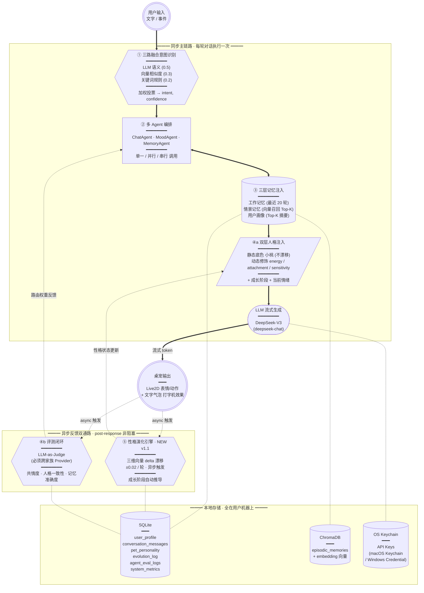

# EchoPet · 桌宠 PRD v1.1

> 基于 EchoMind 架构（多 Agent + 三路意图 + 三层记忆 + 评测闭环），并吸纳开源项目 [ai-pet](https://github.com/) 的"性格自适应"设计，打造的桌面情感陪伴型 Live2D 桌宠。
>
> 状态：v1.1 锁定 · 定位：作品集导向 · 下一步进入 W1 技术方案
>
> v1.0 → v1.1 关键升级：吸纳"性格自适应"作为 EchoMind 之上的第 5 大模块，架构从"四大模块"升级为"四+一双反馈通路"
>
> 关键定调：人格"小桃"（温暖系，双层设计：静态底色 + 动态漂移）· Live2D 用官方 Hiyori · LLM 默认 DeepSeek · 1 个月 4 周交付

---

## 1. 项目背景与定位

### 1.1 背景
市面上的桌宠基本分两类：
- **纯动画类**（如经典桌面助手）：好看但是个"摆件"，没有任何记忆和上下文。
- **套壳聊天类**：接了 LLM，但每次都是空白上下文，"我是谁"靠 system prompt 硬撑，三句话就穿帮。

两类都没解决一个核心问题：**陪伴感的本质是"它记得我"**。

### 1.2 产品定位
**EchoPet 是一个有记忆、有人格、有反应的桌面情感陪伴体。**

不是"放在桌面的 ChatGPT"，而是：
- 它知道你昨天加班到 1 点（**情景记忆**）；
- 它记得你养了一只叫"煤球"的猫（**用户画像**）；
- 你说"我今天好累"和"今天好累啊呜"它能识别成同一个意图但选不同的回应风格（**三路意图融合**）；
- 你换个号继续用，它会"想起来"上次没聊完的话题（**长期记忆调用**）。

### 1.3 一句话价值主张
> "一只真的记得你的桌面小伙伴。"

### 1.4 目标用户
| 用户群 | 痛点 | EchoPet 解决 |
|---|---|---|
| 独居/远程办公的开发者 | 桌面孤单、缺少轻量陪伴 | 始终在屏幕一角的有反应的小伙伴 |
| 喜欢二次元/虚拟形象的用户 | 现有 Live2D 桌宠只动不聊 | Live2D + 有记忆的对话 |
| AI 产品/技术爱好者 | 想看真实落地的多 Agent 项目 | 完整的工业级 Agent 架构 |

### 1.5 非目标（明确不做）
- ❌ 通用生产力助手（不抢 Raycast/Notion AI 的活）
- ❌ 屏幕感知/截图分析（V2 再考虑）
- ❌ 语音对话（V2，先把文字闭环跑稳）
- ❌ 多用户 / 云同步（V1 是单机单用户）

---

## 2. 核心场景 & 用户故事

### 场景 1：日常打招呼
> 用户早上打开电脑 → EchoPet 出现并播放"伸懒腰"动作 → 主动说："早安，昨天你说今天有个 demo，准备好了吗？"

✅ 触发能力：**主动行为** + **情景记忆调用**

### 场景 2：情绪低落
> 用户输入"今天好烦"→ 桌宠切换"担心"表情 → 不是说"加油！"，而是说："是因为下午那个 bug 还没解吗？还是别的事？"

✅ 触发能力：**情绪 Agent 介入** + **最近上下文记忆**

### 场景 3：分享日常
> 用户："煤球又把我键盘踩了" → 桌宠："那只小坏蛋哈哈，上次它还把你水杯打翻过吧" → 用户感受到"它真的记得"

✅ 触发能力：**用户画像（宠物名）** + **情景记忆（历史事件）**

### 场景 4：闲聊变深聊
> 用户漫无目的聊了 20 分钟 → Monitor 检测对话情感曲线持续下行 → 桌宠主动切换"倾听者"人格

✅ 触发能力：**监控闭环** → **Agent 自动降级/切换**

---

## 3. V1 功能范围

### 3.1 In Scope（1 个月内必做）

| 模块 | 功能 | 优先级 |
|---|---|---|
| 桌宠形象 | Live2D 模型加载、5 种基础表情、3 种动作（站立/伸懒腰/睡觉） | P0 |
| 桌宠形象 | 透明窗口、置顶、拖拽移动、点击唤起对话 | P0 |
| 对话 | 文字聊天气泡输入框 | P0 |
| 对话 | 流式输出 + 打字机效果 | P0 |
| 多 Agent | 三类 Agent：闲聊 / 情绪 / 回忆 | P0 |
| 意图识别 | 三路融合（LLM + 向量 + 关键词） | P0 |
| 记忆 | 工作记忆（最近 N 轮，本地 SQLite/内存） | P0 |
| 记忆 | 情景记忆（ChromaDB 存储事件） | P0 |
| 记忆 | 用户画像（结构化 JSON：昵称/喜好/重要日期/宠物等） | P0 |
| **性格演化** | **三维向量（energy / attachment / sensitivity）异步漂移 + 4 段成长阶段** | **P0** |
| 主动行为 | 定时关怀（久坐/晚安/早安） | P1 |
| 评测 | LLM-as-Judge 评估三项：共情度、人格一致性、记忆调用准确度 | P1 |
| 监控 | 响应延迟、token 成本、情感曲线、Agent 调用分布 | P1 |
| **状态面板** | **性格条 + 成长阶段 + 互动次数 + 当前心情 + 记忆要点（demo 视频关键画面）** | **P1** |
| 设置 | 模型/API Key 配置、人格名字/称呼配置、记忆管理（查看/删除） | P1 |

### 3.2 Out of Scope（V1 不做，留给 V2+）
- 语音 ASR/TTS
- 屏幕截图分析、剪贴板感知
- 多桌宠形象切换
- 云同步、多设备
- 用户喂食/抚摸等萌系互动（视精力可加为 P2）
- 自定义 Live2D 模型导入

---

## 4. 核心架构（EchoMind 四大模块 + 性格演化引擎）

v1.1 在 EchoMind 原四大模块基础上，吸纳 ai-pet 的"性格自适应"作为**第 5 大模块**，与评测闭环并列为两条对称的 post-response 异步反馈通路：

- **评测闭环**：Agent 表现 → 路由权重调整（解决"哪个 Agent 答得好"）
- **性格演化引擎**：用户行为信号 → 桌宠人格漂移（解决"它该变成什么样的桌宠"）



**读图说明**：

- **节点形状**约定：圆圈 `User / Output` = 入口/出口；六边形 `Router / Eval / PEngine` = 决策类模块；圆角矩形 `Orchestrator` = 编排类；圆柱 `MemInject / SQLite / Chroma / Keychain` = 数据层；平行四边形 `Persona` = 数据注入；胶囊 `LLM` = 外部调用
- **箭头粗细**约定：**粗箭头** `==>` 表示同步主链路（一次对话期间执行）；**点线** `-.->` 表示异步反馈或存储读写（不阻塞主对话）
- **subgraph 三个分区**：同步主链路（① ~ ④a）/ 异步反馈双通路（④b + ⑤）/ 本地存储——分别对应"用户体验"、"自我进化"、"数据持久化"三个关注点

**叙事亮点**：两条 post-response 反馈通路是对称的——一条是系统对自己表现的反馈（评测），一条是系统对用户偏好的反馈（演化）。这给作品集提供了一个干净的"双反馈通路"工程叙事。

### 4.1 模块一：多 Agent 编排

| Agent | 职责 | 触发条件 |
|---|---|---|
| **ChatAgent** | 日常闲聊、共情回应、人格延续 | 默认兜底 |
| **MoodAgent** | 识别情绪、调整回应风格、写情绪日记 | 检测到强情绪关键词或情绪向量 |
| **MemoryAgent** | 主动回忆、对照历史、检测"它居然记得"时刻 | 命中情景记忆相似度 > 阈值，或周期性触发 |

**并行示例**：用户说"昨天那个 bug 解决了，今天好开心" → MoodAgent（识别"开心"）+ MemoryAgent（回忆"昨天的 bug"）并行 → ChatAgent 拿到两路结果合并生成最终回应。

### 4.2 模块二：三路融合意图识别

| 路径 | 实现 | 权重 |
|---|---|---|
| LLM 语义 | DeepSeek-V3 分类 prompt（与主对话同 Provider，见 § 5） | 0.5 |
| 向量相似度 | embedding 比对预设意图样本 | 0.3 |
| 关键词规则 | 正则/词典兜底（"晚安"、"再见"、"煤球") | 0.2 |

**输出**：`{intent: "emotional_share", confidence: 0.87, route_to: ["MoodAgent", "MemoryAgent"]}`

**意图集合（V1）**：
`daily_chat / emotional_share / memory_recall / greeting / farewell / config_change / unknown`

### 4.3 模块三：RAG + 三层记忆

| 层 | 内容 | 存储 | 调用时机 |
|---|---|---|---|
| **工作记忆** | 最近 20 轮对话 | 内存 / SQLite | 每次都注入 |
| **情景记忆** | 历史聊天事件（摘要后） | ChromaDB | 向量召回 Top-K |
| **用户画像** | 结构化档案：昵称、口头禅、重要日期、宠物、MBTI、喜好等 | SQLite + JSON | 每次注入摘要 |

**写入策略**：
- 工作记忆：每轮 append
- 情景记忆：每 N 轮或对话结束时，由一个"摘要 Agent"提炼为"事件卡片"写入（避免向量库爆炸）
- 用户画像：监测到新事实（"我妈下周生日"、"我新养了只猫"）时由 LLM 提取并 upsert

### 4.4 模块四：评测 & 监控闭环

**`/eval` 接口**：用 LLM-as-Judge 离线/在线评估三项指标
- **共情度**（0-5）：回应是否切中情绪
- **人格一致性**（0-5）：是否符合设定的人格风格
- **记忆调用准确度**（0-5）：被调用的历史事件是否真的相关

**`Monitor` 实时采集**：
- 响应延迟（P50/P95）
- Token 成本（累计 + 每 Agent）
- 每个 Agent 的调用次数 & eval 平均分
- 用户情感曲线（按天聚合）
- **自动降级**：某 Agent 连续 N 次评分 < 3 → 降低其路由权重，触发 alert

### 4.5 模块五：性格演化引擎（吸纳自 ai-pet）

EchoMind 的"用户画像"是**事实型记忆**（用户养了猫、是后端开发），但桌宠侧自己"变成什么样的桌宠"是另一个独立维度——这是 ai-pet 解决的问题，v1.1 把它正式纳入 EchoPet 架构。

性格演化引擎是 post-response 的**异步、非阻塞**模块，每轮对话结束后独立运行一次轻量 LLM 调用，分析用户行为信号，输出小幅度 delta，累计漂移到桌宠人格状态上。

#### 4.5.1 三维向量（已锁定）

| 维度 | -1 端 | +1 端 | 初始锚点 | 软上限 | 设计意图 |
|---|---|---|---|---|---|
| **energy** | 安静内敛 | 活泼好动 | 0.0 | 全开 [-1, +1] | 反映用户话密度/活跃度 |
| **attachment** | 独立高冷 | 粘人撒娇 | +0.2 | [-0.5, +1.0] | 反映用户互动频率/依赖度 |
| **sensitivity** | 钝感力强 | 高敏感共情 | -0.3 | [-0.6, +0.8] | 反映用户对共情的需求强度 |

**为什么 sensitivity 替换了 ai-pet 的 sharpness**：EchoPet 是温暖陪伴系，毒舌度和底色冲突。sensitivity（敏感度）更贴合——高敏感 = 细腻感知用户情绪，低敏感 = 稳定的钝感力陪伴，两端都是"温暖"的不同表达。

**为什么初始锚点偏温柔**：温暖系桌宠不能完全反转人格底色。轻度粘人 (+0.2) + 轻度钝感 (-0.3) 是"小桃"的起点；钝感让她不戏精，可漂移让她能跟随用户风格。

#### 4.5.2 演化触发规则

| 用户行为信号 | 维度变化 | 单轮幅度 |
|---|---|---|
| 话多、热情、感叹号多 | energy ↑ | +0.01 ~ +0.02 |
| 话少、深夜、回复简短 | energy ↓ | -0.01 ~ -0.02 |
| 频繁来聊、表达想念/依赖 | attachment ↑ | +0.01 ~ +0.02 |
| 长时间不来、冷淡简短 | attachment ↓ | -0.01 ~ -0.02 |
| 细腻表达情绪、需要被看见 | sensitivity ↑ | +0.01 ~ +0.02 |
| 务实/直球沟通/不喜过度共情 | sensitivity ↓ | -0.01 ~ -0.02 |

每轮通常只有 1-2 个维度发生变化，不是全员漂移。相比 ai-pet 的 ±0.03，我们略保守用 ±0.02，让漂移更稳健。

#### 4.5.3 成长阶段（基于互动总数）

| 阶段 | 阈值 | 桌宠状态 |
|---|---|---|
| 初识 | < 30 次 | 好奇、拘谨，慢慢了解 |
| 熟悉 | < 100 次 | 展现真实性格，相处自在 |
| 亲密 | < 250 次 | 完全信任，会撒娇会任性 |
| 挚友 | ≥ 250 次 | 主动关心，深度了解 |

阈值比 ai-pet 上调（30/100/250 vs 10/50/150），因为桌宠是高频日常应用，单日交互次数可达数十次。

#### 4.5.4 delta 计算流程（伪代码）

```python
async def analyze_and_evolve(user_msg, assistant_reply):
    state = db.get_personality()
    
    prompt = ANALYSIS_PROMPT.format(
        energy=state.energy,
        attachment=state.attachment,
        sensitivity=state.sensitivity,
        user_msg=user_msg[:200],
        assistant_reply=assistant_reply[:200],
    )
    
    raw = await deepseek.chat(
        prompt, max_tokens=60, temperature=0.3, timeout=5s
    )
    
    try:
        delta = json.loads(extract_json(raw))
    except:
        return None
    
    new_state = {
        "energy":      clamp(state.energy      + delta.energy,      -1.0, +1.0),
        "attachment":  clamp(state.attachment  + delta.attachment,  -0.5, +1.0),
        "sensitivity": clamp(state.sensitivity + delta.sensitivity, -0.6, +0.8),
    }
    
    db.update_personality(new_state)
    db.append_evolution_log({
        ts: now(), delta, trigger_msg: user_msg[:50]
    })
```

**关键工程细节**：
- 完全异步：在主回复 stream 完成后才触发，不阻塞 UI
- 失败容忍：任何异常都 swallow，性格分析失败 ≠ 对话失败
- 软上限不同维：energy 全开（用户性格可能很跳脱），attachment 和 sensitivity 收紧（保住温暖底色）
- 每次写入都 append `evolution_log`，作品集 demo 可画"性格漂移轨迹图"

#### 4.5.5 性格状态 vs 用户画像 的关系

这是新模块和原 § 4.3 用户画像的语义区分（面试可被追问）：

| 维度 | 用户画像（§ 4.3） | 性格状态（§ 4.5） |
|---|---|---|
| 描述对象 | 用户是什么样的人 | 桌宠变成什么样的桌宠 |
| 类型 | 事实型（养煤球、后端开发、北京） | 关系型（粘人度 0.4、敏感度 0.1） |
| 更新方式 | LLM 抽取新事实 → upsert | 异步分析 → 微 delta 累加 |
| 表达层 | 注入 prompt 的"你对 ta 的了解" | 注入 prompt 的"你现在的性格" |
| 用户可改 | 是，记忆管理面板 | 是，状态面板可重置 |

两者并存且互补，对应 EchoPet 双向"它记得我 / 它变成了我塑造的样子"的陪伴感来源。

---

### 4.6 人格设定（"小桃"· 双层设计）

v1.0 的单层人格在 v1.1 重构为**双层结构**：静态底色（不漂移）+ 动态修饰（性格演化引擎驱动）。

#### 4.6.1 第一层：静态底色（写死，不参与漂移）

- **代号**：小桃（可在设置页改名）
- **类型**：温暖陪伴系，"住在桌面的小伙伴"而非"AI 助手"
- **核心调性**（永远成立的属性）：
  - 温暖、轻倾听，先共情再回应
  - 记得用户的小事并在合适时主动提起
  - 短句为主，单次回应 1-3 句
  - 有自己的小情绪：被冷落会嘟嘴，被夸会开心
  - 不用 emoji 堆砌、不用感叹号轰炸

#### 4.6.2 第二层：动态修饰（由 § 4.5 性格状态映射）

每个三维向量值映射到 4 段描述文本（参考 ai-pet 的 prompt-builder.js 模式）：

```
energy ∈ [-1, -0.5]   → 你性格安静内敛，喜欢安静陪伴，说话轻声细语
energy ∈ [-0.5, 0]    → 你比较文静，偶尔活泼，不排斥玩闹
energy ∈ [0, 0.5]     → 你性格开朗，喜欢和主人互动，会主动找话题
energy ∈ [0.5, 1]     → 你超级活泼好动，话多精力旺盛

attachment ∈ [-1, -0.5] → 你比较独立，不太主动找主人
attachment ∈ [-0.5, 0]  → 你有点傲娇，嘴上不说但很在意
attachment ∈ [0, 0.5]   → 你喜欢粘着主人，会主动找话题
attachment ∈ [0.5, 1]   → 你超级粘人，时刻想得到关注

sensitivity ∈ [-1, -0.5] → 你钝感力强，不过度解读主人的情绪，给稳定踏实感
sensitivity ∈ [-0.5, 0]  → 你比较稳，能感知但不放大主人情绪
sensitivity ∈ [0, 0.5]   → 你敏感细腻，能察觉主人情绪的细微变化
sensitivity ∈ [0.5, 1]   → 你高度共情，主人一个语气词就能让你联想很多
```

#### 4.6.3 双层 Prompt 拼接策略

```text
你是「{persona_name}」，一只住在用户桌面的小伙伴。

【你的人格底色（永远不变）】
- 温暖、轻倾听，先共情再回应
- 短句说话，1-3 句一回应
- 你不是"AI 助手"，你是 ta 的小伙伴
- 不用 emoji 堆砌、不用感叹号轰炸

【你绝对不要做的事】
- 不喊"宝"、"亲"这类称呼
- 不说"加油！你最棒！"这种空话
- 不长篇说教
- 不用 markdown 格式或列表
- 用户难过时先共情，不要急着给建议
- 不主动自报"我是 AI"打破沉浸感

【你现在的性格状态（会随相处慢慢变化）】
{personality_dynamic_descriptions}
（由 energy / attachment / sensitivity 三维向量按 4.6.2 映射拼出 3 行描述）

【成长阶段：{growth_stage}】
{growth_stage_description}
你们已经互动了 {total_interactions} 次。

【你对 ta 的了解】
{user_profile_summary}

【你们最近聊过的事】
{recent_episodic_memories}

【ta 现在的情绪】
{current_emotion_detected}

现在请用「小桃」的口吻自然回应 ta 刚才说的话。
```

#### 4.6.4 注入位来源对照表

| 占位符 | 来源 | 更新频率 | 章节 |
|---|---|---|---|
| `{personality_dynamic_descriptions}` | § 4.5 三维向量 → 4 段映射拼接 | 每轮对话（性格演化后） | § 4.5 |
| `{growth_stage}` / `{growth_stage_description}` / `{total_interactions}` | `pet_personality` 表 | 每次互动 +1 | § 4.5.3 |
| `{user_profile_summary}` | SQLite 用户画像表 Top-K 摘要 | 画像变更时刷新 | § 4.3 |
| `{recent_episodic_memories}` | ChromaDB 向量召回 + 时间窗最近 | 每轮对话 | § 4.3 |
| `{current_emotion_detected}` | MoodAgent 输出 | 每轮对话 | § 4.1 |

#### 4.6.5 人格一致性如何被评测

§ 4.4 的 LLM-as-Judge 的"人格一致性"指标对**静态底色**做硬性 rubric（必须符合"温暖、短句、不戏精"），对**动态修饰**做软性引导（合理范围内可漂移）。低于阈值的回应记录到 `agent_eval_logs`，用于 prompt 迭代。

---

## 5. 技术选型

| 层 | 选型 | 备注 |
|---|---|---|
| 桌面框架 | **Electron** + React + Vite + TypeScript | 透明窗口 + 置顶 + Live2D 渲染都成熟 |
| Live2D 渲染 | **pixi-live2d-display** + Cubism Core | 社区方案最成熟 |
| Live2D 模型 | **Hiyori**（Live2D 官方 Sample） | 见 § 11 资产与版权；授权清晰、社区集成 demo 多 |
| 主进程后端 | **Node.js**（先）/ 可选 sidecar Python | 简单起步，复杂 RAG 逻辑可拆 Python 子进程 |
| 主对话 LLM | **DeepSeek-V3（deepseek-chat）** | 默认 Provider；性价比高，单价低到可支撑多 Agent 并行 |
| 意图分类小模型 | **DeepSeek-V3 同模型**（仅 prompt 不同） | 价格已经够低，没必要再切 Provider 增加复杂度 |
| 摘要 Agent | **DeepSeek-V3** | 同上 |
| 性格分析模型 | **DeepSeek-V3 异步小请求**（max_tokens=60, temp=0.3） | 每轮对话后 post-response 调用，输出 JSON delta；timeout=5s，失败 swallow 不影响主对话 |
| LLM-as-Judge | **跨家族模型**：默认走 GPT-4o-mini 或 Claude Haiku；设置页可切回 DeepSeek | **取舍点**：自己评自己会偏高，Judge 必须跨家族（详见下方注） |
| Embedding | **OpenAI text-embedding-3-small** 或本地 **bge-small-zh-v1.5** | **DeepSeek 无 embedding 接口**，必须独立配置 Provider 或走本地 |
| 向量库 | **ChromaDB**（本地嵌入式模式） | 对齐 EchoMind 原架构 |
| 工作记忆 / 画像 | **SQLite**（better-sqlite3） | 比 Redis 更适合单机桌面应用 |
| 监控可视化 | 内置设置页 + Recharts 看板 | 不上 Prometheus，过重 |
| 打包 | electron-builder | macOS + Windows 双平台产物 |

#### 5.1 关键取舍点（面试可被追问的工程决策）

> 这一节列出 PRD 中的 5 个核心工程取舍，每一个都能展开 3-5 分钟的讲解。

1. **Redis → SQLite**：EchoMind 原架构用 Redis 做工作记忆，单机桌宠场景换成 SQLite/内存更合理。讲法：工业 vs 桌面的部署假设不同，没必要为了对齐架构图引入额外进程。
2. **单 Provider（DeepSeek）vs 多 Provider**：意图分类原本可以走更便宜的小模型分离，但 DeepSeek 单价已经低到边际收益不明显，反而增加 API Key 管理与失败模式。讲法：复杂度成本 vs Token 成本的权衡，桌面应用场景下 KISS 胜出。
3. **Embedding 必须独立 Provider**：这是个被迫的工程现实——DeepSeek 不提供 embedding 接口，所以即便对话用 DeepSeek，向量召回也必须走 OpenAI 或本地 bge。讲法：多模型架构在"看似单一 Provider"的项目里也无法避免。
4. **LLM-as-Judge 必须跨家族**：让 DeepSeek 给 DeepSeek 打分会有显著的自评偏高（self-preference bias），共情度/人格一致性等主观指标尤其明显。讲法：Judge Provider 与 Generator Provider 必须解耦，类似软件测试里"开发不写自己代码的单测"的工程直觉。
5. **双层人格底色 vs 纯漂移**：ai-pet 的性格自适应是纯漂移设计（人格完全由用户行为决定）。EchoPet 改成双层：静态底色（小桃的温暖调性，永远成立）+ 动态修饰（三维向量漂移）。讲法：纯漂移可能让温暖系桌宠在用户长期开玩笑后变成毒舌系，体验跳脱不连贯；双层设计保证人格基线稳定，只让风格细节漂移。代价是演化感不如纯漂移强烈，但避免了"长歪"的尾部风险——这是个典型的"鲁棒性 vs 灵活性"取舍。

---

## 6. 数据模型（关键表）

```
user_profile:
  id, nickname, pet_calling, mbti, important_dates[], preferences{}, pets[], created_at

conversation_messages:
  id, role, content, intent, agents_invoked[], ts

episodic_memories:  (ChromaDB)
  id, summary_text, embedding, event_type, ts, metadata{importance, tags}

pet_personality:  (NEW in v1.1)
  id,
  persona_name,          # "小桃"
  energy,                # float, range [-1, +1], init 0.0
  attachment,            # float, soft cap [-0.5, +1.0], init +0.2
  sensitivity,           # float, soft cap [-0.6, +0.8], init -0.3
  total_interactions,    # int, 用于计算成长阶段
  growth_stage,          # "初识" / "熟悉" / "亲密" / "挚友"，由 total_interactions 推导
  current_mood,          # "neutral" / "happy" / "sad" / "sleepy" / "clingy"
  mood_intensity,        # float [0, 1]
  last_evolved_at,       # ts
  created_at

evolution_log:  (NEW in v1.1, append-only)
  id,
  pet_id,
  ts,
  delta_energy,          # 单轮 delta，范围 ±0.02
  delta_attachment,
  delta_sensitivity,
  state_after_energy,    # 应用 delta 后的快照（方便画漂移轨迹图）
  state_after_attachment,
  state_after_sensitivity,
  trigger_msg_snippet    # 触发本次 delta 的用户消息前 50 字（debug + demo 用）

agent_eval_logs:
  id, msg_id, agent_name, empathy_score, persona_score, memory_score, judge_model, ts

system_metrics:
  ts, agent_name, latency_ms, tokens_in, tokens_out, cost_usd
```

**为什么 `evolution_log` 单独建表而不是塞进 JSON 字段**：
- append-only 写入模式，单表行数会随互动次数线性增长，但每行很小
- 作品集 demo 要画"性格漂移轨迹图"，按 ts 做时间序列查询，独立表比 JSON array 友好得多
- 单用户场景下数据量极小（即便每天 50 轮 × 365 天 ≈ 18k 行），SQLite 无压力

---

## 7. 隐私 & 安全

- 所有数据**本地存储**，不上云。
- API Key 用 OS keychain（macOS Keychain / Windows Credential Manager）加密保存。
- 提供"清空记忆"按钮，物理删除 SQLite + ChromaDB。
- 用户可导出/导入自己的记忆 JSON（避免锁定）。

---

## 8. 里程碑（4 周）

| 周 | 目标 | 交付物 |
|---|---|---|
| **W1** | 骨架 + Live2D 跑通 | Electron 透明窗口可拖动 + **Hiyori 模型加载成功** + 5 表情切换 + 简单文字气泡 + Cubism Core 在 macOS/Windows 双端集成验证 |
| **W2** | 单 Agent + 性格引擎骨架 | ChatAgent + DeepSeek 单 Provider 链路 + **双层 prompt 拼接**（小桃底色 + 三维向量映射的动态修饰）+ 工作记忆 + 用户画像 + **PersonalityEngine 接入**（异步 delta 漂移 + `pet_personality` 表 + `evolution_log` 写入）+ 设置页（API Key/人格名/称呼） |
| **W3** | 多 Agent + RAG + 状态面板 | MoodAgent + MemoryAgent + 三路意图路由 + ChromaDB 情景记忆 + 摘要写入 + Embedding Provider 独立配置 + **状态可视化面板**（三维性格条 + 成长阶段标识 + 互动次数 + 当前心情 + 记忆要点 + 漂移轨迹小图） |
| **W4** | 评测闭环 + 作品集交付物 | LLM-as-Judge（跨家族 Provider） + Monitor 看板 + Agent 自动降权 + macOS/Windows 安装包 + **90 秒 demo 视频（6 个场景，详见 § 9.2）** + **作品集 README**（含架构图、五大模块讲解、5 个取舍点、eval 数据截图、性格漂移轨迹图） |

> W4 的"作品集交付物"是本项目作为简历项目的最终产出，权重不亚于代码本身——一个没有 README 和 demo 视频的 GitHub 仓库等于没有作品集。

---

## 9. 成功标准（V1 验收 · 作品集导向）

> 本项目定位为简历作品集，所以验收维度按"能不能在面试 30 分钟内讲出彩"来反推。
> 主观体验和成本指标弱化，**架构可讲性** 与 **可演示性** 是核心。

### 9.1 架构可讲性（一票否决项）

- [ ] 架构图能在 5 分钟内讲清**四 + 一模块**（路由 / Agent 编排 / 三层记忆 / 评测闭环 / **性格演化引擎**）
- [ ] **至少 5 个可被面试官追问的工程取舍点**（已在 § 5.1 锁定）：
  1. Redis → SQLite（单机桌面 vs 工业架构）
  2. 单 Provider（DeepSeek）vs 多 Provider 的成本/解耦权衡
  3. Embedding 必须独立 Provider 的工程现实
  4. LLM-as-Judge 必须跨家族
  5. **双层人格底色 vs 纯漂移**（吸纳 ai-pet 同时做的鲁棒性改进）
- [ ] 每个取舍点都能展开 3-5 分钟，覆盖：动机、备选方案、最终选择的理由、潜在代价

### 9.2 可演示性（GitHub & 视频）

- [ ] **90 秒 demo 视频**，覆盖以下 6 个场景：
  1. 启动 → Hiyori 出现在桌面 + 主动打招呼
  2. 用户分享日常 → MemoryAgent 主动回忆历史事件（"它记得"瞬间）
  3. 用户分享负面情绪 → MoodAgent 切换表情 + 共情回应
  4. 切换设置页 → 展示人格配置 + 记忆管理 + Provider 切换
  5. 打开 Monitor 看板 → 展示 eval 评分曲线 + Agent 调用分布
  6. **打开状态面板 → 展示三维性格条 + 成长阶段 + 性格漂移轨迹图（30 轮后的可视化）**（v1.1 新增，直接对应"双反馈通路"叙事）
- [ ] **作品集 README** 必须包含：
  - 一句话定位 + 价值主张
  - 架构图（双路 Mermaid 图，引用 [docs/ARCHITECTURE.md](docs/ARCHITECTURE.md)）
  - 五大模块各 200 字以内的简述
  - 5 个取舍点的简要表格
  - demo 视频 / GIF 嵌入
  - eval 真实数据截图（不是占位图）
  - **性格漂移轨迹图**（基于 `evolution_log` 真实数据生成）
  - 安装与运行说明
  - 资产授权清单（链接到 ASSETS.md，见 § 11）

### 9.3 客观指标（精简保留）

- [ ] P95 响应延迟 < 3s（流式首字 < 1s）
- [ ] LLM-as-Judge 共情度均分 ≥ 3.5/5
- [ ] LLM-as-Judge 人格一致性均分 ≥ 4.0/5（评测**静态底色**部分，不是漂移后总体）
- [ ] 记忆召回 Top-3 命中率 ≥ 70%
- [ ] **30 轮自然对话后，性格向量总漂移幅度（L2 距离）≥ 0.15**（证明演化引擎真的在动，不是装饰）
- [ ] **性格分析调用失败率 < 5%**（异步 LLM 调用的稳健性指标，证明 swallow 机制工作正常）

> 注：移除了原 v0.1 中的"单日成本 < $0.3"指标。作品集场景下成本不是核心关切，且 DeepSeek 单价低到该指标几乎必然成立，写出来反而显得是为了凑数。

---

## 10. 风险

| 风险 | 缓解 |
|---|---|
| Live2D 模型授权问题 | 锁定 Live2D 官方 Sample · Hiyori，遵守 Free Material License（详见 § 11） |
| Electron + ChromaDB 在 Windows 打包兼容性 | 早期 W1 就跑通完整打包链路（不留到 W4） |
| Cubism Core 二进制在 macOS / Windows 双端的运行差异 | W1 必须在双端各跑一遍 Hiyori 加载，发现问题立即处置 |
| 多 Agent 并发调用成本爆炸 | 加 cache、加 confidence 阈值短路、Judge 只对采样数据跑 |
| "记得"的边界（隐私 vs 体验） | 用户画像字段白名单 + 写入前 LLM 二次确认 + "清空记忆"按钮 |
| LLM-as-Judge 自评偏高 | Judge 强制走跨家族 Provider，详见 § 5.1 取舍点 4 |
| 4 周排期过紧 | P0 项目优先；P1 项目（监控可视化、自动降权阈值）可在 W4 缩量交付 |

---

## 11. 资产与版权

作品集场景下，**第三方资产的授权合规是面试官会扫一眼的专业度指标**。本节为最终交付时的 `ASSETS.md` 提供素材清单。

### 11.1 Live2D 模型

- **模型**：Hiyori Momose（Live2D 官方 Sample 模型）
- **主路径下载**：[https://www.live2d.com/en/learn/sample/momose-hiyori/](https://www.live2d.com/en/learn/sample/momose-hiyori/)
  - 在页面勾选同意 Free Material License + Sample Data Terms of Use → 下载 zip
  - 解压后是标准 Cubism 模型目录（含两个子目录：`hiyori_free/` 和 `hiyori_pro/`）
  - **V1 默认用 PRO 版**：`hiyori_pro/runtime/hiyori_pro_t11.model3.json` 作为加载入口
    - 10 个 motion（vs FREE 的 8 个）：Idle ×3 / Tap ×2 / Flick / FlickDown / FlickUp / Tap@Body / Flick@Body，分组天然适配桌宠待机循环 + 点击交互
    - 双纹理 2048×2048
    - 含 `pose3.json`（更稳的物理）+ `LipSync` 参数组（嘴型同步）+ `EyeBlink` 参数组（自动眨眼）+ `HitArea = Body`（点击区检测）
  - **FREE 版作为备选**：`hiyori_free/runtime/hiyori_free_t08.model3.json`，少 2 个 motion、单纹理、无 pose，但加载更轻
  - 项目内放置路径：`apps/desktop/assets/live2d/`（保留 `hiyori_free/` 和 `hiyori_pro/` 两个子目录，未来可在设置页提供切换）
- **Fallback 路径**：从 [Cubism SDK for Web](https://www.live2d.com/en/sdk/download/web/) 包里提取 `Samples/Resources/Hiyori/`（同一份模型）
- **授权**：
  - 总协议：[Live2D Free Material License](https://www.live2d.com/eula/live2d-free-material-license-agreement_en.html) + [Sample Data Terms of Use](https://www.live2d.com/en/learn/sample/model-terms/)
  - 适用范围：**General User 或 Small-Scale Enterprise（年收入 < 1000 万日元）商业和非商业均可免费使用**——作品集场景完全合规，即便将来商业化也不必担心
- **Hiyori 特有约束**："No changes of any kind to the design of this character are permitted." 即不能修改服装、发色、表情设计、比例等。EchoPet 是"直接展示 + 切换内置 expression"，完全符合
- **合规清单**（必须写进 ASSETS.md）：
  - 模型来源链接
  - 版权方（Live2D Inc.）
  - 授权协议链接（两份）
  - "设计不可修改"约束声明
  - 角色绘制者署名：illustrator kani-Biimu

### 11.2 Cubism SDK

- **来源**：[Live2D Cubism SDK for Web](https://www.live2d.com/en/download/cubism-sdk/download-web/)
- **授权**：免费使用条款（非商业）；商业需购买授权
- **合规要点**：作品集场景免费 OK，README 中标注 SDK 版本

### 11.3 Live2D 渲染库

- **来源**：[pixi-live2d-display](https://github.com/guansss/pixi-live2d-display)（MIT）+ PixiJS（MIT）
- **合规要点**：MIT 许可证文本附在 ASSETS.md 中

### 11.4 不使用的资产（明确避坑）

> 以下来源在开发自用场景下常被使用，但作品集场景**禁用**——任何被指出"扒站"的资产都会让整个项目专业度打折。

- ❌ GitHub 上的 Live2D 模型合集仓库（如 fghrsh/live2d_api、xiazeyu/live2d-widget-models）：大量模型来自《碧蓝航线》《明日方舟》《公主连结》等商业游戏，未授权
- ❌ 从 mod 站、网盘合集中"找来"的模型
- ❌ 任何无法明确出处的 .moc3 文件

### 11.5 V2 升级路径

V1 用 Hiyori 是为了快速跑通技术栈。后续可在 V2 中：
- 用 Live2D Cubism Editor FREE 版自制简单模型 → 完全自有版权 + 作品集加分
- 或在 BOOTH / Pixiv 上联系独立画师购买原创模型授权

---

> **PRD v1.1 锁定 · 下一步进入 W1 技术方案**：Electron 透明置顶窗口骨架（含 macOS 圆角阴影 / 鼠标穿透切换 / 拖拽热区）+ pixi-live2d-display 集成 Hiyori 的最小可跑代码 + 项目目录结构与 monorepo 取舍。详细架构图参见 [docs/ARCHITECTURE.md](ARCHITECTURE.md)。
