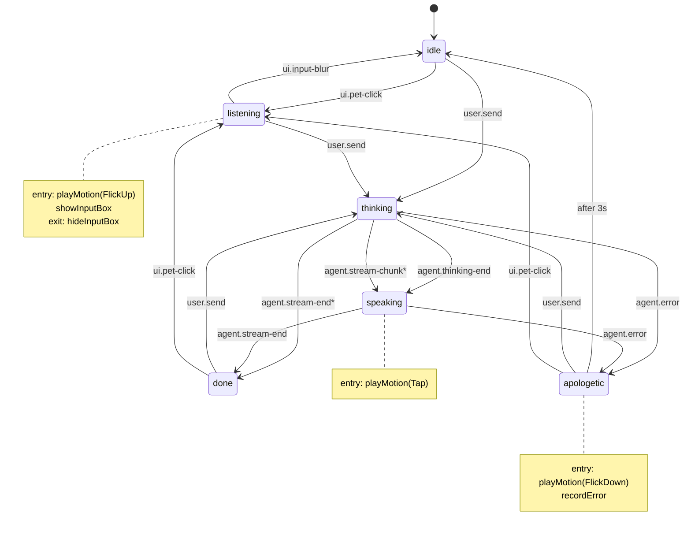

# EchoPet · 角色行为状态机设计

> 状态：✅ **W2 已实现**（commit `c110e52`）· 实现路径：[`packages/state-machine/`](../packages/state-machine/)
>
> 目标：把「用户操作 + Agent 内部状态」**翻译成** Hiyori 的 motion / 参数动作，**全程不由人手点按钮触发**。
>
> **技术选型（已锁定）：**
> - 状态机库：**XState v5**（`^5.32.0`）
> - LipSync：**不做**（V1 范围外，speaking 状态只播 Tap motion，不驱动嘴部参数）
> - 输入框：**默认隐藏，点击角色才弹出**（在角色脚下淡入）
>
> **实现 / 测试**：23/23 转移路径单测全过，含「零 token / 漏 thinking-end / mid-stream error / apologetic 即时退出」等兜底用例。

---

## 1. 设计目标

W1 demo 阶段，6 个状态按钮直接驱动 motion——这是调试入口，**不会进入 V1 正式版**。

V1 阶段，角色动作完全由状态机驱动，触发链路：

```
用户行为 / Agent 事件 → PetEvent → FSM 状态转移 → 派发 motion / LipSync 指令 → Live2DModel
```

要解决的问题：
1. **状态语义清晰** —— 每个状态对应一个清晰的「桌宠正在干嘛」（待机/听/想/说/抱歉）
2. **资源 1:1 映射** —— 状态到 motion 的映射严格 1:1，资源缺哪个动作就明确写出来
3. **与 LLM 解耦** —— FSM 只接受抽象 PetEvent，LLM/Agent 层只发事件，不需要知道 Hiyori 有几个 motion
4. **可单测** —— 纯函数 reducer，UI 完全没参与状态计算

---

## 2. 状态定义（PetState）

按「桌宠正在做什么」分层，**6 个状态**：

| State | 含义 | 触发场景 | Hiyori motion 映射 |
|---|---|---|---|
| `idle` | 默认待机 | App 启动 / 长时间无交互 | `Idle`（随机 m01/m02/m05）循环 |
| `listening` | 在听用户说 | 用户点击角色后输入框弹出，输入框聚焦 / 正在打字 | `FlickUp` 单次（抬头看用户），之后回 `Idle` |
| `thinking` | 正在想 | 用户已发送，等 LLM 首字节 | `Idle` 慢速循环（Hiyori 没有专门思考动作） |
| `speaking` | 输出中 | LLM 流式返回 chunk 中 | `Tap` 单次（开口），motion 不打断 |
| `done` | 刚说完 | LLM 流结束 | 无新 motion，自然 fallback 到 `Idle` |
| `apologetic` | 出错/挫败 | 网络错误 / API 失败 / 用户表达不满 | `FlickDown` 单次（低头） |

> 已剔除：
> - `startled` / `excited` / `shy` —— 这些是「情绪」不是「行为状态」。情绪由 **personality 模块**单独驱动（W3），通过修改当前 motion 的 *播放参数*（速度、混合权重）而不是切换 state，避免状态爆炸。
> - **LipSync** —— V1 范围外。`speaking` 只播 `Tap` motion，嘴部参数完全交给 Hiyori 自带的 motion 动画。

---

## 3. 事件定义（PetEvent）

事件按来源分三类：

### 3.1 用户事件（用户行为产生）

| Event | 数据 | 说明 |
|---|---|---|
| `ui/pet-click` | — | 用户点击角色（区分于拖动），唤起输入框 |
| `ui/input-blur` | — | 输入框失焦 / Esc 取消 |
| `user/send` | `{ text: string }` | 用户回车发送消息 |

### 3.2 Agent 事件（系统内部产生）

| Event | 数据 | 说明 |
|---|---|---|
| `agent/thinking/start` | `{ requestId: string }` | LLM 调用发出 |
| `agent/thinking/end` | `{ requestId: string }` | LLM 首个 token 到达 |
| `agent/stream/chunk` | `{ text: string }` | 流式输出一段文本 |
| `agent/stream/end` | `{ requestId: string }` | 流结束 |
| `agent/error` | `{ error: Error }` | LLM / 网络出错 |

### 3.3 系统事件

| Event | 数据 | 说明 |
|---|---|---|
| `tick/idle` | — | 状态停留超时（如 `done` 停 1.5s 后回 `idle`） |

---

## 4. 状态转移矩阵



\* 标记的是「兜底转移」：renderer 漏发 `agent.thinking-end` / 零 token 回复也不会卡死。

**与 W1 规划的差异**：
- `done` 改成**稳态**（不再 1.5s 后 after-idle），气泡淡出由 UI 层独立 timer 控制（默认问候 10s · 回复 5s）
- `apologetic` 增加 `user.send → thinking` / `ui.pet-click → listening`，用户重试不需要等 3s after

完整 machine 实现见 [`packages/state-machine/src/machine.ts`](../packages/state-machine/src/machine.ts)。

XState 优势：
1. `after`(timeout) / `entry`/`exit` actions 内置，不需要手写 ticker
2. Stately Studio 可视化 export → 直接贴到作品集 / README
3. `@xstate/react` 的 `useMachine` 钩子和 React 集成成熟
4. `@xstate/test` 可以生成测试用例覆盖所有转移路径

---

## 5. 副作用（状态进入时派发的 motion）

XState 把副作用打包成 `entry` / `exit` action，机器定义里直接声明（见上方 machine 骨架）：

| State | entry action | exit action |
|---|---|---|
| `idle` | — | — |
| `listening` | `playMotion(FlickUp)` + `showInputBox` | `hideInputBox` |
| `thinking` | — | — |
| `speaking` | `playMotion(Tap)` | — |
| `done` | — | — |
| `apologetic` | `playMotion(FlickDown)` | — |

React 集成（`@xstate/react`）：

```tsx
const PetActorContext = createActorContext(petMachine)

function PetCanvas() {
  const actorRef = PetActorContext.useActorRef()
  const petControllerRef = useRef<PetController | null>(null)

  // 拦截 playMotion action 注入实际的 motion 调用
  useEffect(() => {
    const sub = actorRef.subscribe((snapshot) => {
      const action = snapshot.context.lastAction
      if (action?.type === 'playMotion') {
        petControllerRef.current?.playMotion(action.params.group)
      }
    })
    return () => sub.unsubscribe()
  }, [actorRef])
  // ...
}
```

---

## 6. 自动 tick / 超时策略（实际实现）

仅 `apologetic` 用 `after`，`done` 改为稳态：

```ts
apologetic:  { after: { 3000: { target: 'idle' } } }
```

`done` 不再自动归位 —— 否则会和 UI 层的「气泡停 5s 后淡出 / 问候 10s 后淡出」timer race。
要从 `done` 离开，用户主动 `user.send` 或 `ui.pet-click` 即可。

进入 state 时 XState 自动 arm 定时器，离开时自动 cancel。

---

## 7. 文件 / 模块拆分（W2 实际实现）

```
packages/state-machine/                  ✅ 纯 TS，无 UI / Electron 依赖，可单测
  src/
    machine.ts                           ✅ petMachine（XState setup + createMachine）
    types.ts                             ✅ PetState / PetEvent / PetMotionGroup / PetContext
    index.ts                             ✅ barrel
  test/
    machine.test.ts                      ✅ 23 vitest 用例覆盖所有转移 + 兜底场景

apps/desktop/src/
  shared/ipcTypes.ts                     ✅ main/preload/renderer 共享 AppSettings + PersonalitySnapshot
  main/
    llm.ts                               ✅ DeepSeek SSE 流式 + AbortController + 60s 超时
    configStore.ts                       ✅ safeStorage 加密 + atomicWrite
    personality.ts                       ✅ W2 mock，W3 替换真实演化引擎
  renderer/src/
    App.tsx                              ✅ useMachine + provide actions + click vs drag + 气泡 timer
    components/ChatInput.tsx             ✅ listening 时 fade-in 淡入 + autofocus
    components/ChatBubble.tsx            ✅ opacity 切换 fade 显隐
    components/ConfigDialog.tsx          ✅ 三段式：桌宠 / 性格 / 模型
```

**与原规划差异**：renderer 没有单独 `state/` 目录 —— XState 5 用 `useMachine` + `machine.provide({ actions })` 在 App.tsx 顶层组装，IPC 副作用直接闭包，足够清晰，没必要再抽 `PetActorContext` / `useLive2DBridge` 增加心智成本。

---

## 8. 验收（W2 完成标准 — 全部 ✅）

1. ✅ **点击角色**（区分拖动）→ 输入框在角色脚下淡入 + 角色 FlickUp（抬头看）
2. ✅ 输入框失焦 / Esc → 输入框淡出 + 状态回 `idle`
3. ✅ 用户回车发送 → 角色切到「思考」（Idle 慢节奏）
4. ✅ LLM 首字节到达 → 角色 Tap 一次（开口）+ 进入 `speaking`
5. ✅ 输出完毕 → 进入 `done` 稳态，UI 层 5s 后气泡淡出
6. ✅ API 出错 → FlickDown 一次，3s 后回 `idle`（或用户主动点击立刻退出）
7. ✅ 整个流程**不需要手点任何调试按钮**（DebugStateBar 已删）
8. ✅ `packages/state-machine` XState machine + **23/23** 单测全过
9. ✅ 状态机 mermaid 图见 §4（GitHub README 原生渲染，不依赖 Stately Studio）

---

## 9. 与 v1.1 PRD 的对齐

PRD §3.1 列了「5 种基础表情、3 种动作（站立/伸懒腰/睡觉）」—— 这是 **资源理想态**，Hiyori PRO 实际只有 7 个 motion group，没有「伸懒腰/睡觉」。

V1 范围对齐方案：
- 「站立」→ `Idle`
- 「伸懒腰」→ `FlickUp`（抬手抬头，最近似的）
- 「睡觉」→ `Idle` 的低速版本（用 motion 参数 `playbackRate < 1`）
- 「5 种表情」→ V1 退化为 **6 个行为状态**，PRD §3.1 在 v1.2 时同步更新

> 这是 Hiyori 免费资源的限制。如果 V2 切到自制 / 商用 Live2D 资源，可以补 motion，但 V1 范围以现有资源为准。
