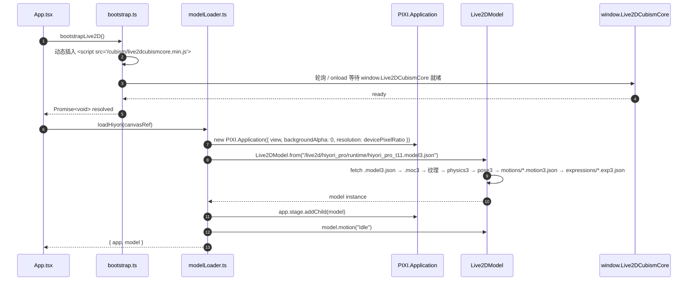

# EchoPet W1 技术方案

> 状态：**v1.0 · 决策已锁，待实施**
> 周次：4 周排期的第 1 周
> 上游：[PRD § 5 技术选型](PRD.md#5-技术选型) · [§ 8 里程碑](PRD.md#8-里程碑4-周) · [§ 11 资产与版权](PRD.md#11-资产与版权)

---

## 0. W1 目标（边界精确）

W1 的唯一交付物：

> **一个能在 macOS + Windows 双端跑起来的透明置顶 Electron 窗口，里面跑着 Hiyori PRO Live2D 模型，能切 5 种表情，弹一个写死内容的文字气泡。**

### 明确不做（防止 W1 蔓延）

- ❌ LLM 调用 → W2
- ❌ 任何数据存储（SQLite / ChromaDB）→ W2 起
- ❌ 真正的聊天输入框 → W2
- ❌ 设置页 → W2
- ❌ 多个 Agent / 意图路由 → W3
- ❌ 评测闭环 → W4
- ❌ electron-builder 正式出包 → W4（但 yml 骨架本周写好）

> **W1 的本质是一次"技术栈实战 spike"**：跑通 Electron + pixi-live2d-display + Hiyori 这条最长依赖链，验证选型可行性。

---

## 1. 技术栈锁定（含具体版本号）

| 层 | 选型 | 版本 | 备注 |
|---|---|---|---|
| 桌面框架 | Electron | `^34`（脚手架默认） | 跟 electron-vite 给的 latest stable |
| 构建工具 | electron-vite | `^2` | `npm create @quick-start/electron@latest` |
| UI 框架 | React + Vite | `^18` / `^5` | electron-vite react-ts 模板 |
| 语言 | TypeScript | `^5` | `strict: true` |
| 包管理 | pnpm | `^9` | workspace 模式 |
| 渲染引擎 | **PixiJS** | **`^6.5.0 <7`** | ⚠️ 锁死 v6，不允许升 v7 |
| Live2D 桥接 | **pixi-live2d-display** | **`^0.4.0`** | 稳定版（非 advanced fork） |
| Live2D 运行时 | Cubism Core for Web | **R7（SDK 5.x）** | ⚠️ 不上 npm，手动 setup 脚本拉 |
| Live2D 模型 | Hiyori PRO `t11` | 已就位 | `hiyori_en/hiyori_pro/runtime/` |

### 1.1 关键版本取舍：pixi-live2d-display 0.4 vs advanced 2.0-beta

**面试可被追问的工程决策**：为什么不用 2026 年的社区 fork [`pixi-live2d-display-advanced`](https://github.com/Untitled-Story/pixi-live2d-display-advanced)？

| 维度 | `pixi-live2d-display@0.4` ✅ 选用 | `pixi-live2d-display-advanced@2.0-beta` |
|---|---|---|
| 状态 | 稳定，1.4k star | beta，star 数小 |
| PixiJS 兼容 | v6 | v7（更现代） |
| 社区资料 | 多年沉淀，SO / 中文教程齐 | 资料稀薄 |
| 风险面 | 已知坑都有解 | beta 阶段，潜在新坑无解 |
| 维护活跃度 | 2024 年后零更新 | 2026-01 仍有 release |

**决策**：W1 用稳定版 0.4 + PIXI v6。**取舍原则：作品集 1 个月周期内，稳定性 > 技术新鲜度**。如果 W2 之后有特殊需求（WebGPU / PIXI v8 API），再单独做升级评估。

---

## 2. 项目目录结构（pnpm monorepo）

```
桌宠/                                       # 仓库根（已存在）
├── apps/
│   └── desktop/                            # ★ Electron 主 app（W1 全部代码）
│       ├── electron/                       # 主进程 + preload
│       │   ├── main/
│       │   │   ├── index.ts                # 入口、单例锁、托盘（可选）
│       │   │   └── window.ts               # BrowserWindow 工厂：透明 + 置顶 + 穿透
│       │   └── preload/
│       │       └── index.ts                # contextBridge（W1 几乎为空）
│       ├── src/                            # 渲染进程（React）
│       │   ├── main.tsx                    # React 挂载点
│       │   ├── App.tsx
│       │   ├── components/
│       │   │   ├── PetCanvas.tsx           # Live2D <canvas> 容器
│       │   │   ├── ChatBubble.tsx          # 静态气泡（W1 写死）
│       │   │   └── DebugExpressionBar.tsx  # 5 个表情按钮（W4 删）
│       │   ├── live2d/
│       │   │   ├── bootstrap.ts            # 动态注入 Cubism Core
│       │   │   ├── modelLoader.ts          # 加载 hiyori_pro_t11.model3.json
│       │   │   ├── expressions.ts          # 5 种表情切换
│       │   │   └── types.d.ts              # window.Live2DCubismCore 全局类型
│       │   └── styles/
│       │       └── globals.css             # 透明背景、无滚动条
│       ├── public/                         # Vite 静态资源（dev 服务）
│       │   └── live2d/                     # → 软链 hiyori_en/
│       ├── resources/                      # electron-builder extraResources（W4 用）
│       │   ├── live2d/
│       │   └── cubism/
│       ├── vendor/                         # 非 npm 第三方资产
│       │   └── live2dcubismcore.min.js     # ⚠️ .gitignore，setup 脚本生成
│       ├── electron.vite.config.ts
│       ├── electron-builder.yml            # W1 占位，W4 用
│       ├── tsconfig.json
│       ├── tsconfig.node.json
│       └── package.json
├── packages/                               # 预留，W2 起放 @echopet/core 等
├── docs/                                   # 已存在
│   ├── PRD.md
│   ├── ARCHITECTURE.md
│   ├── W1-TECH-PLAN.md                     # ← 本文
│   └── img/
├── hiyori_en/                              # 已存在，Hiyori 原始素材，只读
├── scripts/
│   └── setup-cubism-core.sh                # 拉 Cubism Core 到 vendor/
├── pnpm-workspace.yaml
├── package.json                            # workspace 根
├── .gitignore
└── README.md
```

### 2.1 几个值得讲的决策

1. **monorepo 从 W1 就立起来**：PRD 已经写了 `apps/desktop/` 路径。W2+ 会拆 `@echopet/core`、`@echopet/eval` 等独立包，立结构省后期迁移。代价是 W1 多一个 `pnpm-workspace.yaml` 文件，可忽略。

2. **Hiyori 资产分三处摆放**（dev / 打包 / 源）：
   - `hiyori_en/` — 原始素材，只读，永不动
   - `apps/desktop/public/live2d/` — dev 服务路径，**软链接**指回 `hiyori_en/`（不拷贝，省盘 + 改一处生效）
   - `apps/desktop/resources/live2d/` — electron-builder `extraResources` 输出路径，W4 才填
   - W1 只做 dev 路径的软链

3. **Cubism Core 不进 git**：Live2D Cubism SDK 协议非完全开放（详见 [PRD § 11.2](PRD.md#112-cubism-sdk)），不直接 commit 二进制文件。改用 `scripts/setup-cubism-core.sh` 在 `pnpm install` 后自动从本地 SDK 拷贝（或者 README 教用户手动拷贝）。`vendor/live2dcubismcore.min.js` 加 .gitignore。

---

## 3. Hiyori 加载流程（含 5 个已知坑）

### 3.1 加载时序图



### 3.2 五个必踩的坑（按踩坑顺序）

**坑 1 · Cubism Core 必须在 pixi-live2d-display 之前加载到全局**

错误做法：

```ts
import { Live2DModel } from 'pixi-live2d-display';
// 直接 import → 运行时报错 "Live2DCubismCore is not defined"
```

正确做法（`bootstrap.ts`）：

```ts
export async function bootstrapLive2D(): Promise<void> {
  if ((window as any).Live2DCubismCore) return;
  await new Promise<void>((resolve, reject) => {
    const s = document.createElement('script');
    s.src = '/cubism/live2dcubismcore.min.js';
    s.onload = () => resolve();
    s.onerror = reject;
    document.head.appendChild(s);
  });
}
```

然后 `App.tsx` 里：

```ts
await bootstrapLive2D();
const { Live2DModel } = await import('pixi-live2d-display');
```

动态 import 保证 Cubism Core 全局变量已经就绪后才求值 pixi-live2d-display 的初始化代码。

---

**坑 2 · PIXI 版本必须锁 v6.x，禁止漂到 7+**

`apps/desktop/package.json`：

```json
{
  "dependencies": {
    "pixi.js": "~6.5.10",
    "pixi-live2d-display": "^0.4.0"
  }
}
```

注意用 `~` 不用 `^`，防止 lockfile 重生时漂到 v7。pixi-live2d-display 0.4 的 peerDeps 是 v6，v7 改了 `PIXI.Ticker` 等 API，会运行时崩。

---

**坑 3 · Hiyori 资源路径必须走 HTTP，不能走 file://**

pixi-live2d-display 内部用 fetch 加载 `.model3.json` 关联的所有依赖文件（.moc3、纹理、motion、expression）。Electron 渲染进程默认能用 file://，但 pixi-live2d-display 期望 web 协议。

解决：Hiyori 资源放在 `apps/desktop/public/live2d/`（Vite 自动服务为 `http://localhost:5173/live2d/...`），生产环境 electron-vite 会把 `public/` 内容打到 `dist/renderer/`，自动用 `app://` 协议服务。

W1 只关心 dev 模式，等 W4 出包再处理 production 路径。

---

**坑 4 · 透明窗口 + WebGL canvas 的 alpha 通道要三处同时透**

| 位置 | 配置 |
|---|---|
| Electron `BrowserWindow` | `transparent: true, backgroundColor: '#00000000'` |
| PIXI Application | `new PIXI.Application({ backgroundAlpha: 0 })` |
| CSS | `html, body, #root, canvas { background: transparent; }` |

任何一处没透就会出白底或黑底。**建议 W1 一开始就先把这三处搞透**，免得后面加 Live2D 时混淆"是模型问题还是窗口问题"。

---

**坑 5 · macOS HiDPI 下 Hiyori 模糊**

Hiyori PRO 纹理是 2048×2048，但 PIXI 默认 `resolution: 1`，Retina 屏会糊。

修复：

```ts
new PIXI.Application({
  view: canvasRef.current,
  resolution: window.devicePixelRatio || 2,
  autoDensity: true,
  backgroundAlpha: 0,
});
```

---

## 4. 透明置顶窗口配置

### 4.1 BrowserWindow 关键参数

`apps/desktop/electron/main/window.ts`：

```ts
import { BrowserWindow } from 'electron';

export function createPetWindow(preloadPath: string) {
  const win = new BrowserWindow({
    width: 400,
    height: 600,
    transparent: true,
    frame: false,
    alwaysOnTop: true,
    resizable: false,
    skipTaskbar: false,        // W1 先保留任务栏图标方便调试
    hasShadow: false,          // ⚠️ macOS 透明窗开阴影会黑边
    webPreferences: {
      preload: preloadPath,
      contextIsolation: true,
      nodeIntegration: false,
      sandbox: false,           // 允许 preload 用 require
    },
  });

  win.setAlwaysOnTop(true, 'screen-saver');     // 屏保级置顶
  win.setVisibleOnAllWorkspaces(true);          // macOS 多桌面可见
  return win;
}
```

### 4.2 鼠标穿透切换（桌宠灵魂体验）

需求：**模型周围透明区点击穿透到桌面，只有 Hiyori 身上才能拖动 / 交互。**

W1 简化版实现：

1. 默认开 `win.setIgnoreMouseEvents(true, { forward: true })`：全窗口透传
2. 渲染进程监听 `mousemove`，调 `model.hit(x, y)` 判断是否命中
3. 命中 → IPC `ipcRenderer.send('pet:mouse-on')` → 主进程 `win.setIgnoreMouseEvents(false)`
4. 离开 → `pet:mouse-off` → 重新设回 true

pixi-live2d-display 0.4 自带 `model.hitTest(x, y)` 返回命中的 HitArea 名（Hiyori 有 `Body` 一个 HitArea），直接用。

### 4.3 平台差异速查

| 行为 | macOS | Windows |
|---|---|---|
| 透明窗口 | `transparent: true` 即可 | 同上 |
| 圆角阴影 | `hasShadow: false` 必须关 | 不必关，但开了也无害 |
| 多桌面可见 | `setVisibleOnAllWorkspaces` | 不适用 |
| 任务栏图标 | 默认显示 | 同上 |
| 拖拽热区 | `-webkit-app-region: drag` ❌ 透明窗不可用 | 同左 |
| 穿透切换 | `setIgnoreMouseEvents(true, {forward:true})` | 同上 |

---

## 5. 五个表情切换（W1 验收点之一）

Hiyori PRO 自带 8 个 expression。W1 挑 5 个最有辨识度的：

| # | Hiyori 文件 | 用途 |
|---|---|---|
| 0 | `F01.exp3.json` | 默认 / 浅笑 |
| 1 | `F02.exp3.json` | 开心 |
| 2 | `F03.exp3.json` | 害羞 |
| 3 | `F04.exp3.json` | 难过 |
| 4 | `F05.exp3.json` | 惊讶 |

W1 在画布右下角放一个 debug 按钮条（5 个圆按钮），点击调 `model.expression(index)`。**W4 删掉**这个 debug 条，表情切换改由 MoodAgent 在 W3 自动驱动。

---

## 6. 已知风险与缓解

| 风险 | 概率 | 影响 | 缓解 |
|---|---|---|---|
| Cubism Core 在 Windows 端 WebGL 兼容问题 | 中 | 高 | **W1 必须在双端各跑一遍**，问题立报（PRD § 10 风险条款已写） |
| pixi.js 自动升级到 v7 撞坏 0.4 | 高 | 中 | `package.json` 用 `~6.5.10` 锁住，CI 跑 `pnpm install --frozen-lockfile` |
| 透明窗口在 Windows 11 + Intel UHD 显卡有黑底 | 低 | 中 | 兜底加 `app.disableHardwareAcceleration()` 或 `--disable-gpu-compositing` |
| Vite dev 服务对 Hiyori 静态资源 304 缓存错乱 | 低 | 低 | dev 时关 ETag：`server.headers: { 'Cache-Control': 'no-store' }` |
| Cubism Core 协议不允许我们 commit 到 public repo | 已知 | 已避 | `vendor/` 加 .gitignore + 写 setup 脚本 |
| Hiyori 模型设计被改 → 违反 Free Material License | 已知 | 高 | 代码只调用 motion / expression，绝不修改 .moc3 / 纹理（PRD § 11.1 已锁） |

---

## 7. W1 验收清单（demo 给你看的就是这些）

- [ ] `pnpm install && pnpm dev` 在 macOS 上跑起来，Hiyori 浮在桌面，**无白底无黑边**
- [ ] 同样命令在 Windows 上跑起来，行为一致（双端必须各跑一遍）
- [ ] 5 个表情按钮分别切到 5 种表情，切换流畅无闪烁
- [ ] 文字气泡显示写死内容："我是小桃，你好呀～"（W2 接 LLM 后这里变流式）
- [ ] 鼠标移到 Hiyori 身上 → cursor 变 grab，按下能拖动整个窗口
- [ ] 鼠标移到 Hiyori 外的透明区 → 点击穿透到桌面（验证：双击穿透位置能打开桌面图标）
- [ ] Cmd+Q（mac）/ Alt+F4（win）能正常退出
- [ ] 关掉再重启电脑后再启动，行为一致（W1 不做开机自启，W4 再说）

---

## 8. W1 → W2 的接口契约

W1 完成后，W2 直接在这些点接入，不需要重构：

| 模块 | W1 状态 | W2 接入点 |
|---|---|---|
| `electron/main/index.ts` | 单窗口启动 | 注册 LLM IPC handler `ipcMain.handle('chat:send', ...)` |
| `electron/preload/index.ts` | 几乎为空 | 暴露 `window.echopet.chat.send(msg)` |
| `src/components/ChatBubble.tsx` | 静态字符串 | 接 ChatAgent 流式 token，typewriter 效果 |
| `src/live2d/expressions.ts` | 手动按钮 | 接 MoodAgent 输出 enum → 自动 `model.expression(idx)` |
| `src/live2d/modelLoader.ts` | 默认 Idle motion | 加 motion 切换 API（开心时跳 Tap@Body 等）|

---

## 9. W1 估时

| 任务 | 估时 |
|---|---|
| 脚手架 + electron-vite + pnpm workspace 初始化 | 1h |
| Hiyori 软链 + Cubism Core setup 脚本 | 1h |
| 透明置顶窗口 + 鼠标穿透切换（含双端验证） | 4h（macOS 顺利 1h，Windows 可能吃 3h） |
| pixi-live2d-display 集成 + Hiyori 加载 | 3h |
| 5 个表情按钮 + 静态气泡 | 1h |
| Windows 端完整验证 | 2h |
| 兜底排坑预算 | 4h |
| **合计** | **~16h（2 天全力 / 4 天每天 4h）** |

**buffer 评估**：1 周排期约 28h 可用（每天 4h），W1 主体 16h，留 12h buffer。看着挺充裕，但 Electron 跨平台问题量级不定（尤其 Windows 透明窗），buffer 不算多。

---

## 10. 已锁定的决策（v1.0 拍板）

下面 4 个决策已确认，**实施阶段不再调整**。如需变更需走 v1.1 修订：

| # | 决策点 | 锁定选择 | 弃选 | 决策理由 |
|---|---|---|---|---|
| D1 | pixi-live2d-display 版本 | **0.4 + PIXI v6（稳定）** | advanced 2.0-beta + PIXI v7 | 1 月周期稳定性 > 新鲜度 |
| D2 | 项目结构 | **pnpm monorepo（`apps/desktop/`）** | flat 单包 | PRD 已写 `apps/desktop/` 路径，提早立结构 |
| D3 | Cubism Core 分发 | **setup 脚本 + .gitignore** | 直接 commit 到 repo | SDK 协议非完全开放，public repo 安全做法 |
| D4 | W1 是否预留 React | **是（react-ts 模板）** | vanilla-ts，W2 再加 React | PRD § 5 已锁 React，提早立省 W2 重构 |

---

> **W1 v1.0 锁定 · 下一步：实施**
> 顺序：① pnpm workspace + electron-vite 脚手架 → ② Cubism Core setup 脚本 + Hiyori 软链 → ③ 透明置顶窗口 + 穿透切换（双端先验证）→ ④ pixi-live2d-display 集成 Hiyori first frame → ⑤ 5 个表情按钮 + 静态气泡 → ⑥ Windows 端完整验收。
