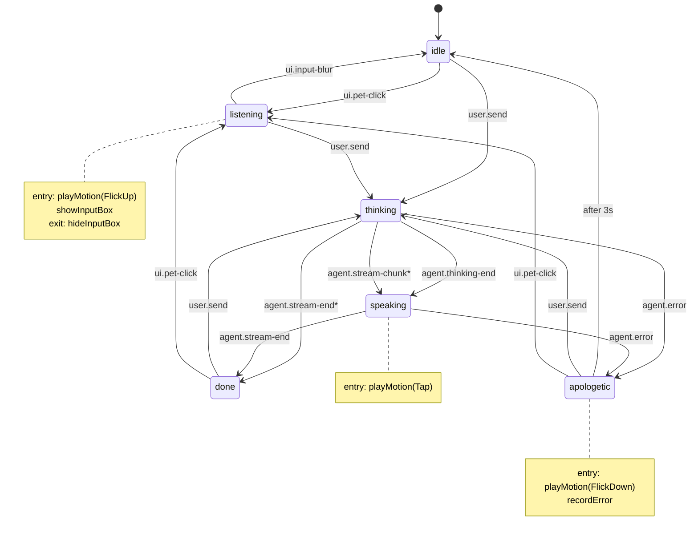

# W2 技术方案 · LLM 闭环 + 状态机驱动

> 状态：✅ **已交付**（commit `c110e52`） · 实际周期：1 天密集开发
>
> 目标：把 W1 的「点按钮播 motion」demo 变成「**输入文字 → DeepSeek 流式回答 → 角色全程自动切换状态**」的真闭环。
>
> 实现亮点：6 状态 XState v5 状态机 + 23 单测覆盖 + SSE 流式 + safeStorage 加密 + 三段式设置面板（含性格三维 mock）

---

## 1. W2 范围（In Scope）

| 模块 | 功能 | 优先级 |
|---|---|---|
| **状态机** | XState v5 实现 6 状态机器（PRD §STATE-MACHINE） | P0 |
| **LLM 接入** | DeepSeek-V3 流式调用，Vercel AI SDK 不上、直接 fetch | P0 |
| **配置面板** | 首次启动让用户填 DeepSeek API Key，存 OS Keychain | P0 |
| **聊天输入框** | 默认隐藏，点击角色淡入到角色脚下；Enter 发送、Esc / blur 关闭 | P0 |
| **聊天展示** | 复用 W1 ChatBubble，绑定 actor snapshot 的 streaming text | P0 |
| **click vs drag 区分** | 鼠标抬起时位移 < 5px 视为 click，> 5px 视为 drag | P0 |
| **错误处理** | 网络 / Key 错误 → apologetic 状态 + 气泡显示原因 | P0 |
| **DebugStateBar** | ~~改 dev-only~~ → W1 收尾时已直接删除 | ✅ N/A |
| **设置面板（W2 末追加）** | 三段式：桌宠名字 / 称呼 · 性格三维进度条（mock）· DeepSeek 配置 | ✅ |

## 2. Out of Scope（W2 不做）

- ❌ LipSync（用户决策：V1 范围外）
- ❌ 长期记忆 / 三层记忆 → W3
- ❌ Personality 漂移 → W3
- ❌ 鼠标 hit-test 穿透 → W2 末或 W3 加（W1 默认全接收事件即可）
- ❌ 多 Agent / 三路意图 → W4

---

## 3. 依赖增项

```jsonc
// apps/desktop/package.json
{
  "dependencies": {
    "xstate": "^5",
    "@xstate/react": "^5"
    // DeepSeek 用原生 fetch + SSE 解析，不引第三方
  }
}

// packages/state-machine（新建）
{
  "dependencies": {
    "xstate": "^5"
  },
  "devDependencies": {
    "@xstate/test": "^1"  // 路径覆盖测试，可选
  }
}
```

**OS Keychain**：
- macOS / Windows：用 Electron 内置 `safeStorage`（无额外原生依赖）
- 不引 `keytar`（编译 native module 麻烦，CI 也痛苦）

---

## 4. 文件清单

### 新增

```
packages/state-machine/
  package.json
  tsconfig.json
  src/
    machine.ts            # petMachine（XState setup + createMachine）
    types.ts              # PetState / PetEvent 导出
    index.ts
  test/
    machine.test.ts       # 转移路径单测

apps/desktop/src/
  main/
    keychain.ts           # safeStorage 包装：read/write/clear DeepSeek key
    ipc.ts                # 集中管理 ipcMain 处理器（拖动 + key + llm-call）
  shared/
    types.ts              # main / renderer / preload 共享类型（IPC contract）
  renderer/src/
    state/
      PetActorContext.tsx # createActorContext + Provider
      useLive2DBridge.ts  # actor 状态变化 → model.motion()
    llm/
      deepseek.ts         # fetch + SSE 解析（renderer 直连，key 由 IPC 取）
    components/
      ChatInput.tsx       # 角色脚下的输入框，受控
      ConfigDialog.tsx    # 首次启动 / 设置面板
```

### 改动

```
apps/desktop/src/
  preload/index.ts        # 新增 keychain.get/set 和 llm.invoke 通道
  preload/index.d.ts      # 同步类型
  renderer/src/
    App.tsx               # 包 PetActorContext.Provider，串 ConfigDialog
    components/PetCanvas.tsx
                          # mousedown→mouseup 计算位移区分 click vs drag
                          # click → actor.send('ui.pet-click')
    components/ChatBubble.tsx
                          # 绑定 actor snapshot.context.bubbleText
    components/DebugStateBar.tsx
                          # 仅 import.meta.env.DEV 时渲染
    live2d/modelLoader.ts # 暴露 playMotion(group) 供 useLive2DBridge 调
```

---

## 5. 关键技术点

### 5.1 click vs drag 区分

W1 现在 mousedown 立刻 startDrag。W2 改成：

```ts
let downAt: { x: number; y: number } | null = null
const DRAG_THRESHOLD = 5 // px

onMouseDown(e) {
  downAt = { x: e.clientX, y: e.clientY }
  // 不立即 startDrag
}

onMouseMove(e) {
  if (!downAt) return
  const dx = e.clientX - downAt.x
  const dy = e.clientY - downAt.y
  if (Math.hypot(dx, dy) > DRAG_THRESHOLD) {
    window.echopet.pet.startDrag()
    downAt = null // 进入拖动模式
  }
}

onMouseUp(e) {
  if (downAt) {
    // 没超阈值 = click
    actorRef.send({ type: 'ui.pet-click' })
  }
  downAt = null
  window.echopet.pet.endDrag()
}
```

### 5.2 ChatInput 在角色脚下淡入

```tsx
// 监听 listening 状态
const isListening = useSelector(actor, (s) => s.matches('listening'))

return (
  <input
    className={cn('chat-input', isListening && 'chat-input--visible')}
    autoFocus
    onBlur={() => actor.send({ type: 'ui.input-blur' })}
    onKeyDown={(e) => {
      if (e.key === 'Enter') actor.send({ type: 'user.send', text: e.currentTarget.value })
      if (e.key === 'Escape') actor.send({ type: 'ui.input-blur' })
    }}
  />
)
```

CSS：默认 `opacity: 0; pointer-events: none; transform: translateY(8px)`，
`.chat-input--visible` 切到 `opacity: 1; pointer-events: auto; transform: translateY(0)`，
配合 200ms transition 实现淡入。

定位：grid template-rows 改成 `auto 1fr auto auto`，第 4 行就是 ChatInput，固定在角色 stage 下方。

### 5.3 DeepSeek 流式调用

```ts
// renderer/src/llm/deepseek.ts
export async function* streamDeepSeek(opts: {
  messages: Msg[]
  apiKey: string
  signal: AbortSignal
}): AsyncGenerator<string> {
  const res = await fetch('https://api.deepseek.com/chat/completions', {
    method: 'POST',
    headers: {
      'Content-Type': 'application/json',
      Authorization: `Bearer ${opts.apiKey}`
    },
    body: JSON.stringify({
      model: 'deepseek-chat',
      messages: opts.messages,
      stream: true
    }),
    signal: opts.signal
  })

  if (!res.ok) throw new Error(`DeepSeek ${res.status}`)

  const reader = res.body!.getReader()
  const decoder = new TextDecoder()
  let buf = ''

  while (true) {
    const { done, value } = await reader.read()
    if (done) break
    buf += decoder.decode(value, { stream: true })
    for (const line of buf.split('\n')) {
      if (!line.startsWith('data: ')) continue
      const json = line.slice(6).trim()
      if (json === '[DONE]') return
      try {
        const delta = JSON.parse(json).choices?.[0]?.delta?.content
        if (delta) yield delta
      } catch {
        /* SSE 分块边界，下一轮拼上 */
      }
    }
    buf = buf.endsWith('\n') ? '' : buf.split('\n').pop()!
  }
}
```

Renderer 直连 DeepSeek（不绕 main 进程）—— key 从 preload 一次性取来后存 ref。

### 5.4 Key 安全存储

```ts
// main/keychain.ts
import { safeStorage } from 'electron'
import { app } from 'electron'
import { writeFileSync, readFileSync, existsSync } from 'fs'
import { join } from 'path'

const KEY_FILE = join(app.getPath('userData'), 'deepseek.key.enc')

export function setKey(key: string): void {
  const buf = safeStorage.encryptString(key)
  writeFileSync(KEY_FILE, buf)
}

export function getKey(): string | null {
  if (!existsSync(KEY_FILE)) return null
  const buf = readFileSync(KEY_FILE)
  try {
    return safeStorage.decryptString(buf)
  } catch {
    return null
  }
}

export function clearKey(): void {
  if (existsSync(KEY_FILE)) writeFileSync(KEY_FILE, Buffer.alloc(0))
}
```

`safeStorage`：
- macOS：走 Keychain（用户登录态加密）
- Windows：走 DPAPI
- Linux：libsecret（fallback 到 plain）

### 5.5 ConfigDialog（首次启动）

启动时 main 检查 keychain 有无 key → 通过 IPC 告知 renderer → 没有就显示 `<ConfigDialog />` 蒙层，输入框 + 「保存并测试」按钮。

测试逻辑：用 key 调一次 DeepSeek `/models` 端点（最便宜的校验），200 OK 就保存。

---

## 6. 实施顺序（实际 1 天完成）

| 天 | 任务 | 状态 |
|---|---|---|
| D1 | `packages/state-machine` 起骨架 + machine.ts + 单测 | ✅ |
| D2 | renderer 接 actor，replace W1 直调 motion → 由 entry action 触发 | ✅ |
| D3 | click vs drag 区分；ChatInput 组件 + CSS 淡入 | ✅ |
| D4 | DeepSeek streamDeepSeek 函数 + ChatBubble 实时绑定 | ✅ |
| D5 | safeStorage + ConfigDialog + IPC 通道 | ✅ |
| D6 | error 路径打通；E2E 手测（链路全通） | ✅ |
| D7 | 状态机图导出 → README；文档更新；W2 收尾 commit | ✅ |

---

## 7. W2 验收清单

1. ✅ 首次启动跳出 ConfigDialog，输入 key 后保存且窗口能正常用
2. ✅ 二次启动直接进入主界面，无 ConfigDialog
3. ✅ 点击角色（< 5px 位移）→ 输入框淡入 + 角色 FlickUp
4. ✅ 拖动角色（> 5px 位移）→ 窗口跟手，不触发输入框
5. ✅ 输入框失焦 / Esc → 淡出 + 角色回 idle
6. ✅ Enter 发送 → 角色切 thinking（"让我想想…" 气泡）
7. ✅ DeepSeek 首字节 → 角色 Tap + 气泡开始填字
8. ✅ 流式输出过程气泡逐字增长，气泡向上扩展不挤角色
9. ✅ 完成后气泡停 5s 自动淡出，状态机停在 done 稳态
10. ✅ API Key 错误 / 网络断 → apologetic 状态 + 气泡显示原因 + 3s 后回 idle，期间也能用户点击立刻退出

**追加验收**（W2 中后期扩展）：
11. ✅ 设置面板（齿轮 FAB）能改名字 / 称呼并持久化（settings.json 原子写）
12. ✅ 设置面板展示性格三维进度条（W2 mock，W3 替换为真实演化引擎）
13. ✅ idle 状态首次进入显示问候 10s 后自动淡出
14. ✅ 23/23 状态机单测全过（含 stream-chunk/stream-end 兜底、apologetic 即时退出等）

---

## 8. 与规划的偏差（W2 实施后回看）

| 规划 | 实际 | 原因 |
|---|---|---|
| LLM 在 renderer 直连 DeepSeek | 改为 **主进程 fetch + IPC 推 chunk/end/error** | API key secret 不该出现在 renderer；同时省 CORS / CSP 问题 |
| ConfigDialog 仅填 key | 扩展为三段式设置面板（基础信息 / 性格 / 模型） | 同步对齐 PRD §3.1「设置 + 状态面板」P1 项 |
| `done` 1.5s after-idle | **改稳态**（不自动归位） | 否则与 UI 层「问候 10s · 回复 5s」双 timer race；statefulness 让 UX 更可控 |
| `done` 1.5s 后输入框消失 | 输入框只在 `listening` 显，`done` 不显 | 需要再点角色（`done.on('ui.pet-click') → listening`）才弹输入框，符合"对话告一段落"语义 |
| DebugStateBar 改 dev-only | 直接删除 | W1 收尾时已经按用户指示删；W2 完全靠状态机自动驱动 motion |
| 输入框定位用 grid template-rows 第 4 行 | 第 3 行 `48px`（永远占位 + opacity 切换） | 避免显隐时 layout reflow 让角色跳一下 |

---

## 9. 与 PRD v1.1 的对齐

PRD §3.1 在 W2 期望覆盖的：
- ✅ "**桌宠形象 - 点击唤起对话**" → click vs drag 5px 阈值
- ✅ "**对话主链路 - DeepSeek 流式**" → `main/llm.ts` SSE 解析 + 60s 兜底超时
- ⏸ "**对话主链路 - 短期记忆**" → W2 单轮调用，W3 起接 SQLite + actor context 维护历史
- ✅ "**设置**" → 三段式 ConfigDialog（基础信息 / 性格 / 模型）
- 🟡 "**状态面板 - 性格条**" → W2 只展示 mock，W3 接真实演化数据
- ⏸ "**意图识别**" → W3，W2 先单 prompt
- ⏸ "**情感 Agent**" → W3
- ⏸ "**性格自适应漂移**" → W3

---

## 10. 状态机最终形态（mermaid）



\* 标记的是「兜底转移」：renderer 漏发 `agent.thinking-end` / 零 token 回复也不会卡死。

实现：[`packages/state-machine/src/machine.ts`](../packages/state-machine/src/machine.ts) · 测试：[`packages/state-machine/test/machine.test.ts`](../packages/state-machine/test/machine.test.ts)

---

## 11. W2 review fixes（commit 前发现的问题）

W2 完整开发后做了一轮 review，找出 + 修复以下问题：

| # | 问题 | 修复 |
|---|---|---|
| 1 | thinking 在零 token / 缺 thinking-end 时卡死 | 加 `agent.stream-chunk → speaking` 和 `agent.stream-end → done` 兜底转移 |
| 3 | SSE 尾行无 `\n` 丢字节 | loop 后 flush buffer + `decoder.decode()` final 调 |
| 4 | 网络 hang 无超时 | 60s 总超时（timedOut flag 区分 outer abort） |
| 5/6 | settings.json / config.enc 非原子写 | `atomicWrite()`：`.tmp.<pid>` + `rename` |
| 7 | `safeStorage` 不可用时 `saveApiKey` 直接 throw | 回退 `memOnlyApiKey`（本会话有效，UI 警告重启丢失） |
| 9 | `userNickname` diff 比较没 trim | 两字段统一 `trim()` 比较 |
| 10 | IPC handler 缺类型校验 | 全部 `unknown` + 内部 typeof / Array.isArray 校验返回 `ok:false` |
| 11 | `chat:send` onError 后仍返回 `ok:true` | 加 `errored` flag |
| 12 | apologetic 3s 内不响应用户操作 | 加 `user.send → thinking` / `ui.pet-click → listening` |
| 14 | `[DONE]` 后未释放 reader | `reader.cancel()` |
| 15 | xstate 版本 workspace 不一致 | 两边对齐 `^5.32.0` |
| 18 | machine 注释过期（done 1.5s after） | 修正 |
| 19 | 死类型 `agent.thinking-start` | 删除 |
